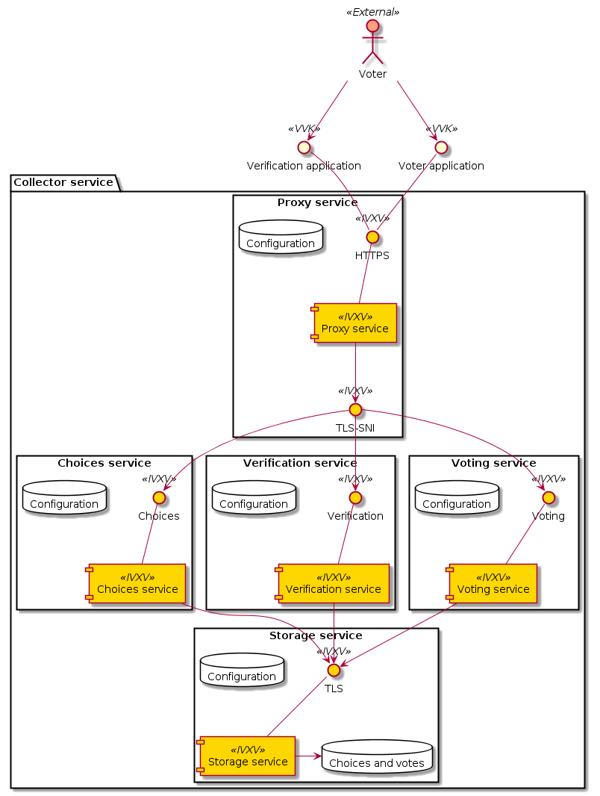
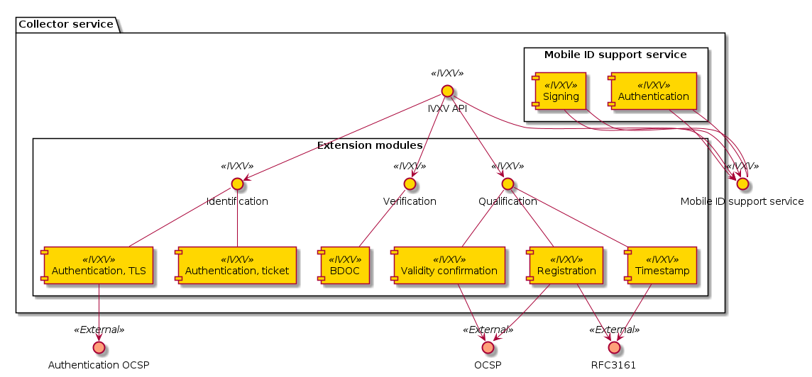
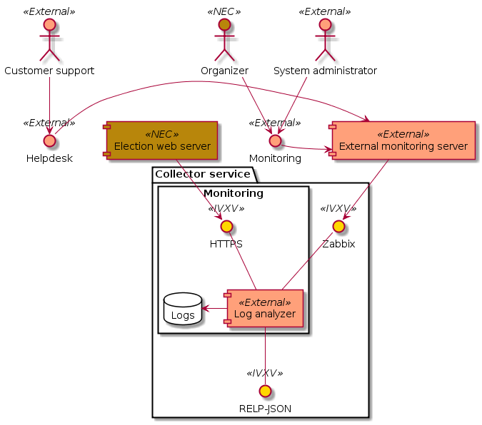
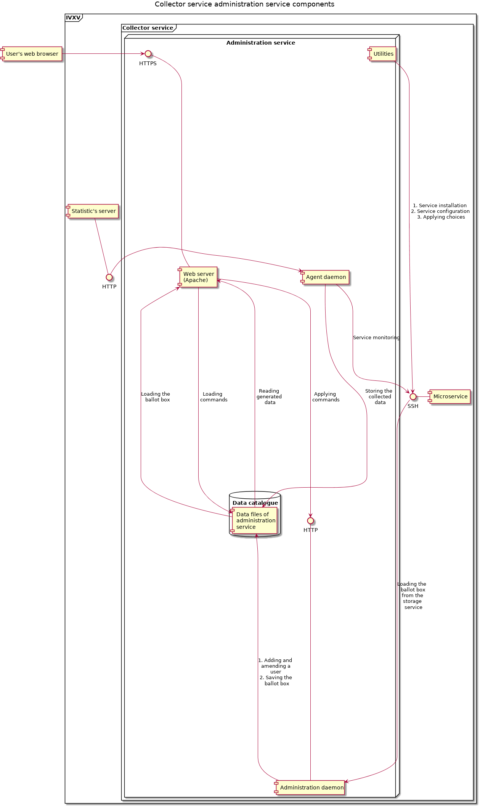
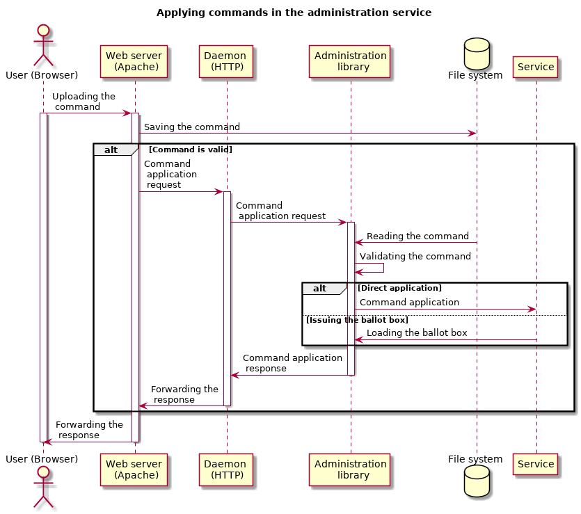
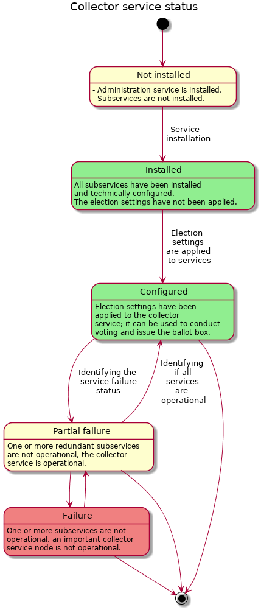
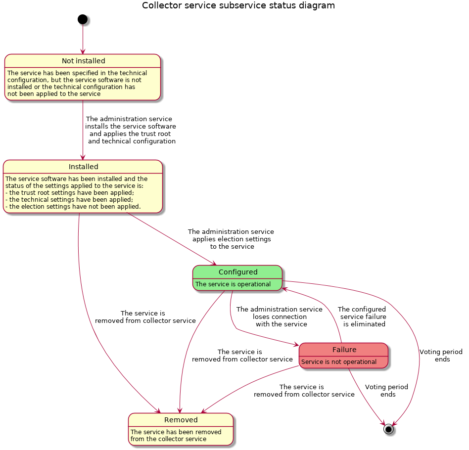

..  IVXV arhitecture

Collector Service
==================

Based on the general specification [ÜK2016]_, the collector service is a
central element in the system, run by the collector. The service helps the voter
compile an i-vote and registers it in the ballot box before storing it. The
collector service uses external services (identification, signing, registering).
The collector service has other administrators apart from the collector
(organizer, customer support), for whom the collector service has separate
administration interfaces.

The collector service works online, and at least the interfaces directed towards
the voter and verification applications are open to the internet. Thus, the
collector service handles requests that potentially originate from an
untrustworthy source. Due to the security requirement of the software, and the
requirements of high availability, scalability, multitier implementation and
extendability, the collector service itself is divided into microservices
providing one specific service that can be implemented flexibly.

All components of the collector service are programmed in `Go
<https://golang.org>`_. The Go programming language has:

- Static typing, which allows finding type errors before the program is launched
- Automatic memory management, which avoids security risks arising from poor
  memory management
- Compiler with an open source code and
- Concurrent programming features allowing (inherent) parallelism in multicore
  systems

Generally, JSON is used as the data transmission format of the collector
service, except in situations where external circumstances require the use of
another data format – the BDOC format, for example, is based on XML.

The collector service supports Riigikogu elections, local government council
elections, European Parliament elections and referendums.

The components of the collector service consider the use of virtualization
technologies, and the collector service can be implemented on both one virtual
hardware instance as well as by microservices on different instances.  Collector
service components can be implemented in the Ubuntu LTS 16.04 operation system
64-bit architecture.

Data retention has been implemented using the key-value database (etcd). For
test purposes, data has also been stored in the file system and memory, but it
is not recommended to use these in the product environment. The collector
service also has an interface for adding new storage protocols. The final
decision regarding the solution to be used is made by the collector service
administrators when configuring the service.

Microservices
-------------



   The collector service divided into microservices

The collector service is divided into main services and support services. The
main services – proxy service, choices service, voting service, verification
service and storage service – are limited to one election in the interests of
the simplicity of the architecture, but the microservices of several elections
can go on one hardware, in one operation system. Additional support services can
be used for the collector service – the identification service to identify the
voter’s person, and the signature service to make it easier for the voter
application to sign a vote.

The services can be implemented separately as well as together in various
configurations, which makes multitier architecture possible. Depending on the
function, it is practical to keep proxy and storage services separate from the
others.

The services use TLS and all connections are authenticated on both sides. The
application layer uses the JSON-RPC (protocol).

All services create an action log that is kept both locally and logged using the
rsyslog interface.

Proxy Service: Function and Technical Interface
````````````````````````````````````````````````

The main function of the proxy service is to offer one entry point (port 443) to
the voter application and the verification application. The proxy service is a
dispatch service between other components that allows implementing the collector
service internally as microservices, while having only one entry point to the
system.  In addition, in case of double implementation, it can act as a load
balancer.

The proxy service does not terminate the TLS connection, but uses the TLS
*Server Name Indication* (SNI) extension to identify the target. Clients put an
SNI extension in the TLS ``ClientHello`` message, where they use open text to
determine the service with which they want to communicate: the proxy service
sees that, contacts the entity providing the relevant service, and starts
sending messages between the client and the service.  The proxy service does NOT
terminate TLS and cannot see the content of the messages.  The proxy service has
data on the locations of all other services (aadress:port) and the service sends
messages between all parties.

The proxy service is a status-free component, which can be scaled horizontally.

Application of the Proxy Service
''''''''''''''''''''''''''''''''
The proxy service is implemented using the free software HAProxy server, which
is a common load balancer and proxy. Since the proxy service is the first access
point for connections coming from the public internet, it is sensible to use
software that has proven to be reliable.

Although HAProxy is often used in HTTP, where it analyses traffic, in the role
of the proxy service it operates in the TCP mode and cannot see inside the
encrypted TLS channel it proxies.

IVXV settings are used to generate the HAProxy configuration file, which
contains the locations of other services, and the task of relaying connections
is left to the latter. In addition, HAProxy can also be configured to limit the
connection frequencies on the basis of the source address or another
denominator.  However, this is the system administrator’s task.

Even though HAProxy is able to function as a load balancer, it can be
implemented behind other, potentially hardware-type load balancers, where it
performs only the task of SNI-based relaying.

The HAProxy source code is public under GPL v2 and version 1.6.3 is packaged in
the official storage of Ubuntu 16.04 (see :ref:`technology`).


Choices Service: Function and Technical Interface
``````````````````````````````````````````````````
The main function of the choices service is to send lists of choices to the
voter application. Information on the identified voter reaches the choices
service and the choices service issues the list of choices that corresponds to
the voter’s district from the storage service to the voter application.

The choices service is a status-free component that can be scaled horizontally.

Verification Service: Function and Technical Interface
```````````````````````````````````````````````````````
The main function of the verification service is to process verification
requests and issue the vote to be verified from the storage service to the
verification application.

The verification service is a status-free component that can be scaled
horizontally.

Voting Service: Function and Technical Interface
````````````````````````````````````````````````
The main function of the voting service is to process voting requests. The
voting service verifies the incoming vote, registers it in the registering
service and stores it in the storage service.

The voting service is a status-free component that can be scaled horizontally.

Storage Service: Function and Technical Interface
`````````````````````````````````````````````````
The main function of the storage service is to execute the long-term retention
of choices, voter lists and votes.

Storage technology that allows for distributed data retention has to be used for
the horizontal scaling of the storage service.

Application of the Storage Service
''''''''''''''''''''''''''''''''''

The storage service is not aware of the IVXV protocol or the specifics of the
data to be retained; it is a general-use key-value database for storing binary
data. All the knowledge on the structure of the data to be retained and the
hierarchy of keys is in other services that use the storage service and act as
“smart” clients.

This approach allows using any common key-value database as the storage service
without much trouble: the only tasks are to convert IVXV settings into a format
suitable for the database and to launch the service. The database software only
has to allow retention and reading based on the key, listing the keys by a
prefix, and an automatic (*compare-and-swap*) operation.

The storage service is an important determiner of the working speed of the
collector service; that is why the hardware providing that service affects the
performance of the entire system and should be dimensioned according to the
database used.

At the moment, the only storage service application that is intended as a
product uses the distributed key-value database etcd. `The recommendations <https://coreos.com/etcd/docs/latest/op-guide/hardware.html>`_ of the
authors of the etcd hardware should be followed.

Identification Service: Function and Technical Interface
````````````````````````````````````````````````````````
The main function of the identification service is to identify the voter’s
identity.  The identification service is necessary when the user uses mobile ID
authentication, for example.

Signing Service: Function and Technical Interface
`````````````````````````````````````````````````
The function of the signing service is to support the voter application in
signing a vote.  The signing service is necessary when the user uses mobile ID
to sign, for example.

Mobile ID Support Service Execution
''''''''''''''''''''''''''''''''''''

The composition of IVXV includes the mobile ID support service, which acts as
both the identification service and signing service for mobile ID. The voter
application sends IVXV requests to the mobile ID support service, which converts
them into mobile ID requests and sends them to the mobile ID service provider.

In case of successful mobile ID identification, the support service issues to
the voter application a ticket that can be used to confirm the voter’s identity
to other services.  A user can only vote once with each ticket.

In case of signing, the voter application only sends the hash of the vote to be
signed to the mobile ID support service, and uses the signature received in
return in the same way as a signature created with an ID card.

The mobile ID support service does contain a status on unfinished identification
sessions, but otherwise, it is a status-free component. Thanks to this, the
mobile ID support service can be scaled horizontally, provided that all requests
from one identification session are sent to the same entity.

Application of Collector Service Microservices
``````````````````````````````````````````````
The collector service microservices are minimally dependent on external
packages. The necessary dependencies:

- SSH server to conduct administrative activities (the administrative service uses it to manage microservices)
- rsyslog service to collect logs to the log collection service

The collector service microservices are packaged in the .deb format, and can
also be implemented as docker-type containers.

External Services and Extendability
------------------------------------



   Collector service extension modules and external services

The collector service microservices use extension modules to execute various
mechanisms to identify the voter and verify and edit digital signatures, incl.
to register a vote. Extension modules can, in order to enable the execution, use
external services.  In the interests of the extendability of microservices, Go
API has been defined that can be used to implement additional modules as well.
At the moment, the following modules are implemented:

- Authentication with a TLS certificate (ID card)
- Authentication with an identification service ticket (mobile ID)
- BDOC verification
- Certificate status service OCSP
- Timestamp service RFC 3161
- Registration service OCSP
- Registration service RFC 3161

The registration service takes center stage in the IVXV cryptographic protocol,
as it also takes part in the long-term retention of votes.

Registration Service: Function
``````````````````````````````````````````````

The main function of the registration service is to accept signed registration
requests from the voting service, confirm them with its own signed response, and
store them at least until the end of the voting period for auditing at a later
stage.

When resolving potential differences that arise during auditing, it is important
that

- The registration service is able to prove that each confirmation it issued was
  preceded by a registration request from the storage service
- The storage service is able to prove that there is a registration service
  confirmation for every vote it has retained

Sufficient protocol to achieve such a level of verification occurs when both
parties have a key pair for signing, the requests and responses are signed, and
each party keeps a register of the messages of the other party. Such a protocol
can be implemented, for example, in case of an OCSP-based registration service.
However, there may be cases where it is impossible to sign registration requests
with standard means – RFC 3161-based registration – and then the proof necessary
for the registration service has to be provided with other organizational and
technical means.

At the moment, the registration service has two different implementations:

- The OCSP requires the use of the OCSP-based timestamping service implemented
  in Estonia, where the nonce of the signed OCSP request is the hash of the vote
  issued by the voting service. The request is signed using standard OCSP means
- The RFC 3161 component, in case of which, as a non-standard solution, the
  nonce of the timestamp request is the hash of the vote signed by the voting
  service


Adding Collector Service Extension Modules
``````````````````````````````````````````````

The API of the collector service defines six types of extension modules:

- Personal identification (Go package ``ivxv.ee/auth``, e.g. ``tls``),
- Deriving the voter identifier from the identified person certificate (Go
  package ``ivxv.ee/identity``, e.g. ``serialnumber``),
- Deriving the voter’s age from the identifier  (Go package ``ivxv.ee/age``,
  e.g. ``estpic``),
- Signed container verification  (Go package ``ivxv.ee/container``, e.g.
  ``bdoc``),
- Signature verification  (Go package ``ivxv.ee/q11n``, e.g. ``tspreg``) and
- Data retention protocol  (Go package ``ivxv.ee/storage``, e.g. ``etcd``).

To add a new module, a new module identifier has to be added to the module
package, as well as a module execution sub-package. At the initial loading of
the sub-package, the ``Register`` function of the module package has to be
invoked to register the module.

To use a new module, its identifier has to be added to the settings under the
relevant module type with the sub-module setting. The extension module is given
a configuration block referred to by its identifier, and the block will be
processed further within the module.

The module packages and the interfaces required from their modules are specified
in more detail in the document ``IVXV API``. In addition, there is at least one
application per module that can be used as an example.


Monitoring
-----------



   Monitoring solution

Logging
````````

The log generated by each microservice is defined systematically based on the
protocol specification and the status diagram of service provision.
At a minimum, the following is logged:

* The fact of receiving each request and the start of processing

* Giving processing over to an external component

* The return of processing to the components

* End of processing the request and the result

* Going through additional important stages in the process status model

The following principles are adhered to when logging:

* The rsyslog service is used for logging; it only takes a millisecond to
  register the moment when a log message is written

* Once a session begins, the system generates a unique identifier that the
  client application uses for its requests when addressing the central system

* All log entries under one session contain the same session identifier

* The log entry can be uniquely identified

* For each logged message, the unique identifier allows identifying the location
  where the message was created in the monitored system

* The log entry is in the JSON schema format; for automatic monitoring,
  machine-readability is primary and human-readability secondary

* The information to be logged is sanitized (urlencode), and given a length
  limit (total length and by parameters)

* Information coming from outside the system perimeter is only logged in a sanitized
  form, only in the prescribed length

Since logging is done via rsyslog, it is possible to use the Guardtime module to
ensure the integrity of logs.


General Statistics
``````````````````

The statistics web interface is used to monitor the following statistics:

* The number of successfully collected votes / number of voters

* Voters by gender, age group, operation system and means of authentication

* Number of successfully verified votes/voters

* Repeat votes

* Voters by country based on their IP addresses


Detailed Statistics
```````````````````

Detailed statistics are aggregated based on logs using the SCCEIV log analyzer,
which analyses the action log of applications in relation to the predefined
profile, and allows performing session/error code-based analysis.

Detailed statistics are available using the HTTPS interface.


.. _kogumisteenuse-haldus:

Administration
--------------

The collector service administration is done using digitally signed
configuration packages.

The collector service provides two interfaces for loading configuration packages:

* Command line interface – the application verifies the signature, validates
  that the commands are in line with and match the collector service status. The
  command is implemented using a separate utility

* Web interface – sends the configuration package to the command line interface
  and returns to the user information on the result of the loading process. If the loading was
  successful, the configuration package is implemented automatically and is based
  on the same principles

The functions of the web interface are:

* Monitoring the status of the collector service microservices

* Managing election lists

* Displaying statistics on the progression of e-voting

* Managing the users of the administration service

* Displaying the collector service administration log

All commands sent to the application are kept – even the ones that were not
implemented. Faulty commands (those that cannot be validated) are not kept.

The collector service may perform the following actions automatically:

* Preparing stored votes, logs and settings for backup and archiving them in the backup service


Administration Service Components
`````````````````````````````````



   Collector service administration service components

#. **The administration web server** is an Apache server operating in the
   ``www-data`` rights of a system user, and its tasks are:

   #. Initial servicing of HTTPS requests from users:

      #. Proving the reliability of the administration service (TLS certificate)

      #. User authentication

   #. Serving generated webpages and data files from a data repository

   #. Filling a general background data request response with the data of the
      logged-in user (WSGI)

   #. Initial validation of uploaded commands and sending them to the
      administration daemon, and sending the administration daemon’s relevant
      responses to the client (WSGI)

#. **The administration daemon** is a web server operating in the ``ivxv-admin``
   admin rights of a user account and listening on the local (``localhost``)
   interface, and its tasks are:

   #. Validating the commands that are uploaded

   #. Directly applying the uploaded commands (user administration)

   #. Storing uploaded commands for later application (to apply settings and
      voting lists to the service)

   #. Proxy the downloading of the ballot box

#. **The agent daemon** is a web server operating in the ``ivxv-admin`` rights
   of a user account and its tasks are:

   #. Data collection and registration:

      #. The status of known microservices

      #. Downloading activity monitoring statistics

#. **The data repository** is a catalogue on the file system, where the
   administration service components keep the collected and generated data (for
   a more detailed specification, see the annexes to the ``IVXV collector
   service administration guide``)

External components with which the administration service comes into contact:

#. **Collector service subservices** - installation, configuration and status
   data collection is done via the agent daemon (SSH connection into the service
   machine)

#. **Monitoring server** - downloading general statistics data
   to display it in the administration service



   Loading commands into the administration service


Collector Service Statuses
-----------------------------

The status of the collector service reflects the status of all the subservices
of the service, the status of the external services used, and the overall status
derived from the above. The administration service is responsible for
identifying the status of the collector service.

The overall situation statuses are:

#. **Not installed** - the status after the installation of the administration
   service until the installation of all subservices

#. **Installed** - all subservices are installed, technical settings have been
   applied, as well as the cryptokeys required for the operation of the service.
   Election settings have not been applied (but can be loaded into the
   administration service)

#. **Configured** - the collector service has been configured and is operational,
   it can be used to conduct voting and issue the ballot box

#. **Partial failure** - the collector service has been configured and is
   partially operational, some subservices are not operational, but it does not
   hinder the operation of the collector service

#. **Failure** - an important node of the collector service is not operational,
   it is impossible to provide the service as required



   Status diagram of the collector service. Statuses according to color: yellow
   – being configured, red – failure, green – operational


Statuses of the Subservices of the Collector Service
````````````````````````````````````````````````````



   Status diagram of a subservice registered by the administration service.
   Statuses according to color: yellow – being configured, red – failure, green
   – operational


Changes in the Collector Service Status
```````````````````````````````````````

The status of the collector service can be monitored as of the successful
installation of the administration service, the original status is  **Not
installed**.


Not installed
'''''''''''''

The trust root and the technical configuration are applied to the collector
service:

#. The settings are loaded into the collector service

#. The subservices specified in the technical configuration are installed

#. The trust root and the technical configuration are applied to the subservices

If the configuration is applied successfully, the new status of the system is
**installed**.


Installed
'''''''''''

The collector service settings are applied to all subservices, but the election
settings are not applied.  Election settings are loaded into the administration
service and applied to the subservices.

If the election settings are applied successfully, the new system status is
**configured**.


Configured
'''''''''''

All subservices of the collector service are configured and operational.  The
administration service has fresh status reports from all subservices.  The
system can be used to conduct the voting and issue the ballot box.

If a failure is found in the system, the new status of the system is  **partial
failure**.

The system can never go from the status **configured** back to the statuses
**not installed** või **installed**, although if new subservices are added
(until they are **not installed/installed**), the relevant criteria would be
met.


Partial Failure
'''''''''''''''

The system is configured and partially operational, some doubled parts of the
system are not operational, but this does not keep the system from functioning.

If the failure worsens to the limit where the system is no longer able to
provide the service, the new status of the system will be **failure**. Once all
failures are eliminated, the new status of the system will be **configured**.


Failure
''''''''

A failure is identified in the configured system that prevents service provision.

Once the failures are eliminated to the point where the system can be used to
provide the service, the new status of the system will be **partial failure**.


Removed
''''''''

The service has been removed from the configuration.
