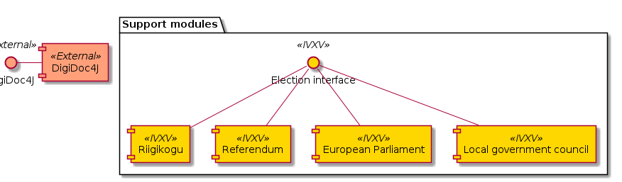
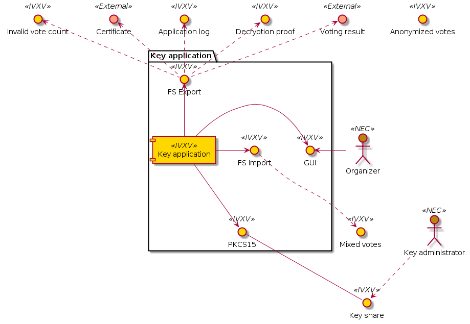
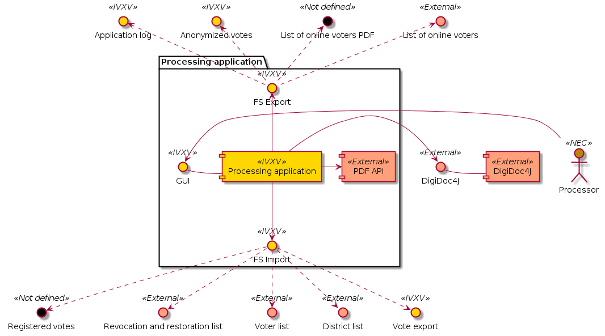
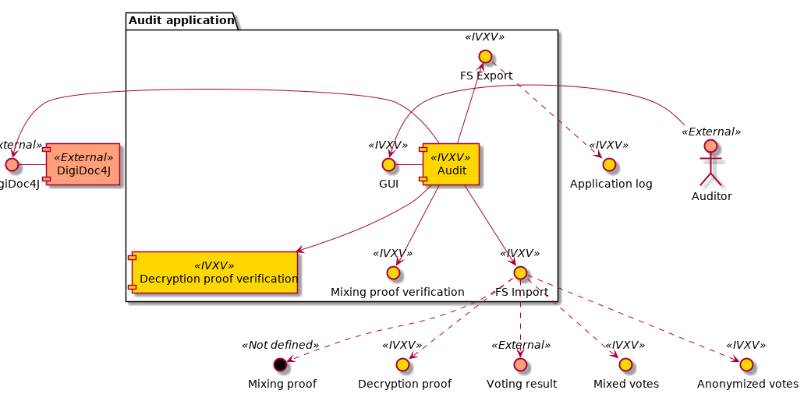

..  IVXV arhitecture

Applications
============


General Principles
------------------

All applications are applications with a command line interface, packaged to
function in the operation system Windows 7 (or newer). The user interfaces of
components are single-language. The components are delivered in Estonian, and
can be translated using a translation file.

The applications are programmed in Java.

Applications communicating with external information systems make maximum use of
the existing interfaces/data structures.

The applications get their input from the application settings and from the file
system files shown in the settings, and save their output into the folder
specified by the user in the file system. The files can also be located on a
main memory disk.

Relevant applications support the ElGamal cryptosystem in the multiplicative
group of integers and the P-384 elliptic curve. The decryption proof is
implemented on a protocol based on the Schnorr zero-knowledge proof.



   Application support modules


The election interface is unified for applications that allow implementing
various election types as modules. The functionality of verifying digital
signatures is created using the `digidoc4j <https://github.com/open-eid/digidoc4j>`_ library.  The use of support modules is not
highlighted separately in the diagrams below.

Application Configuration
`````````````````````````

Applications are configured with either a digitally signed configuration package
or with command line keys. Command line keys do not support entering a configuration
with a hierarchical nature. The settings in a configuration package are
specified in YAML:

.. code-block:: yaml

   check:
     ballotbox: votes.zip
     ballotbox_checksum: votes.zip.sha256sum.bdoc
     districts: TESTKOV2017.districts.json
     registrationlist: register.zip
     registrationlist_checksum: register.zip.sha256sum.bdoc
     tskey: ts.pub.key
     vlkey: test.gen.pub.key
     voterlists:
       -
         path: 00.TESTKOV2017.gen.voters
         signature: 00.TESTKOV2017.gen.voters.signature
       -
         path: 03.TESTKOV2017.gen.voters
         signature: 03.TESTKOV2017.gen.voters.signature
       -
         path: 06.TESTKOV2017.gen.voters
         signature: 06.TESTKOV2017.gen.voters.signature
       -
         path: 09.TESTKOV2017.gen.voters
         signature: 09.TESTKOV2017.gen.voters.signature
     election_start: 2017-05-01T12:00:00+03:00
     out: out-1
   squash:
     ballotbox: out-1/bb-1.json
     ballotbox_checksum: out-1/bb-1.json.sha256sum.bdoc
     districts: TESTKOV2017.districts.json
     out: out-2
   revoke:
     ballotbox: out-2/bb-2.json
     ballotbox_checksum: out-2/bb-2.json.sha256sum.bdoc
     districts: TESTKOV2017.districts.json
     revocationlists:
       - 12.TESTKOV2017.gen.revoke.json
       - 13.TESTKOV2017.gen.revoke.json
       - 14.TESTKOV2017.gen.revoke.json
       - 15.TESTKOV2017.gen.revoke.json
     out: out-3


Input Consistency Check
`````````````````````````````````

All applications perform an input consistency check for the configuration
depending on the settings they use:

#. Loading certificate configuration
#. Verifying the digital signature of the configuration
#. Verifying the district list
#. Verifying the consistency of the district list
#. Loading the district list
#. Verifying the list of choices
#. Verifying the consistency of the list of choices
#. Loading the list of choices
#. Verifying the voter lists
#. Verifying the consistency of the voter lists
#. Loading the voter lists

Key Application
-----------------



   Key application interfaces


The key application is an application used to generate vote encryption and
decryption key for each vote, and to count the votes and issue the result.

The key application uses the [DesmedtF89]_ threshold scheme, which is based on a
trustworthy part distributor and uses the Shamir secret sharing, which is safe in
an information theoretical sense in case
of a :math:`t < M` party, where M is the threshold.

The key shares are generated in the main memory and saved on a chip card using
the PKCS15 interface.

The key application input for generating the key is:

- The key pair identifier
- The cryptosystem ElGamal specification – the multiplicative group of integers
  or the P-384 elliptic curve and key length
- The M-N threshold scheme specification that has to meet the rule :math:`N >= 2 * M - 1`
- N PKCS15-compatible chip cards

The key application output for generating the key is:

- A self-signed certificate
- N key shares saved on chip cards
- The application’s detailed action log
- The application’s detailed error log

The key application input for counting votes is:

- Mixed votes
- Key pair identifier
- M key shares pursuant to the threshold scheme specification

The key application output for counting votes is:

- The signed voting result
- Invalid vote count
- The decryption proof (protocol based on the Schnorr zero-knowledge proof,
  referred to in the contract documents)
- The application’s detailed action log
- The application’s detailed error log

In addition to the interfaces and dependencies defined earlier, the processing
application uses a third-party library to implement the PKCS15 interface. The
specific library is selected in the design stage.

Processing Application
----------------------

The processing application is an application used to verify, cancel and
anonymize the votes collected over the voting period, which functions according
to section 7.6 of the General Description.

The processing application input is:

- Electronic votes stored by the collector service
- Timestamps issued by the registration service
- Voter lists
- District list
- Revocation lists
- Restoration lists

The processing application output is:

- The application’s detailed action log
- The application’s detailed error log
- The list of online voters in a PDF format, depending on the processing stage
- The list of online voters in a format that can be processed by a machine,
  depending on the processing stage
- Anonymized votes

In addition to the interfaces and dependencies defined earlier, the processing
application uses a third-party library to implement the functionality of issuing
PDF files.



   Processing application interfaces

Full Processing of Electronic Votes
`````````````````````````````````````````

For the full processing of electronic votes, the processing application compares
the number of votes stored by the collector service to the number of votes
stored by the registration service, verifies that the stored votes comply with
the election configuration, identifies the votes to be counted, and anonymizes
them for delivery to the key application.

#. Loading application settings
#. Verifying the digital signatures of electronic votes
#. Verifying the registration service confirmations
#. Verifying the timestamps
#. Identifying the latest valid vote for each voter
#. Issuing an initial PDF list of the people who voted online
#. Verifying the revocation and restoration lists
#. Checking the consistency of revocation and restoration lists
#. Implementing the revocation and restoration lists
#. Generating a list of votes to be mixed, separating ciphertexts from digital
   signatures
#. Issuing a final list of people who voted online in a machine-readable format

Generating a List of Electronic Voters
````````````````````````````````````````````````````
#. Loading application settings
#. Verifying the digital signatures of electronic votes
#. Issuing an initial PDF list of the people who voted online

Audit Application
------------------



   Audit application interfaces

The audit application (Figure 9) is an application that mathematically verifies
that the vote count is correct, and if mixing is used, that the mixing is also
correct.

The audit application input is:

- Anonymized votes
- Mixed votes
- Shuffle proof (Terelius-Wikström, Verificatum)
- Voting result

The audit application output is the application’s detailed action log, which
also contains an assessment on the complete success of the audit. If necessary,
the application’s detailed error log is also issued.
