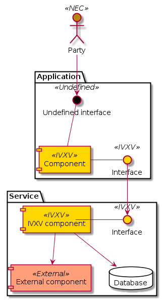

..  IVXV arhitecture

Introduction
============

The online voting information system has been created based on the e-voting
framework [ÜK2016]_ and the technical specification of the public procurement
171780 [TK2016]_. This document specifies the architectural solution of IVXV.
The online voting information system consists of offline applications and
online components. The information system is additionally dependent on external
information systems and affects the components directly used to vote online /
verify votes.

The architecture document specifies the IVXV components, their interfaces with
each other as well as external systems, and the protocols implemented by the
components.

IVXV Concept
------------------

The general, but comprehensive overview of the technical and organizational side
of the online voting system (IVXV) and its implementation at Estonian
state-level elections is given in the general specification of the e-voting
framework [ÜK2016]_.

IVXV as an information system implements the i-voting protocol based on the
envelope scheme. IVXV works in the pre-voting stage, the voting stage, the
processing stage, and the counting stage, offering options to participate in the
online voting process to the organizer, the counter, the voter, the
collector, the processor, the mixer, the auditor, customer support, the voter
list compiler and the editor.

Information system components are the collector service, the processing
application, the key application and the audit application. The voter
application, the verification application and the mixing application are closely
linked to the information system.

In its operation, the information system uses external services: the
identification service, the signing service and the registration service.

IVXV Cryptographic Protocol
-------------------------------

To achieve a situation where online voting is safe and verifiable, voting is
secret and correct, and voters are independent, the cryptographic protocol of
online voting [HMVW16]_ is strict. The protocol gives an essential and
adequate overview of the structure and security aspects of IVXV. The components
of IVXV implement the subparts of the cryptographic protocol.

The IVXV cryptographic protocol is also specified using the notation that allows
formal verification with the protocol security aspects system [ProVerif]_.

Notation
----------

In this document, we use UML schemas to illustrate the draft architectural
solution, where we differentiate between the following aspects of features –
actors, interfaces, components – with colors and ``<<>>`` markings:

* Marking ``<<IVXV>>`` (yellow) – the interface or component of the information
  system is defined/implemented in the course of work done for a specific
  procurement
* Marking ``<<External>>`` (red) – in implementing some functionality, the
  information system depends on the component of a third party or an existing
  interface, redefining which requires efforts by third parties
* Marking ``<<NEC>>`` (brown) – similar to the previous one, but NEC is the owner of
  the interface/component
* Marking ``<<Not defined>>`` (black) – an interface important to the information
  system has not been defined

   Example schema
