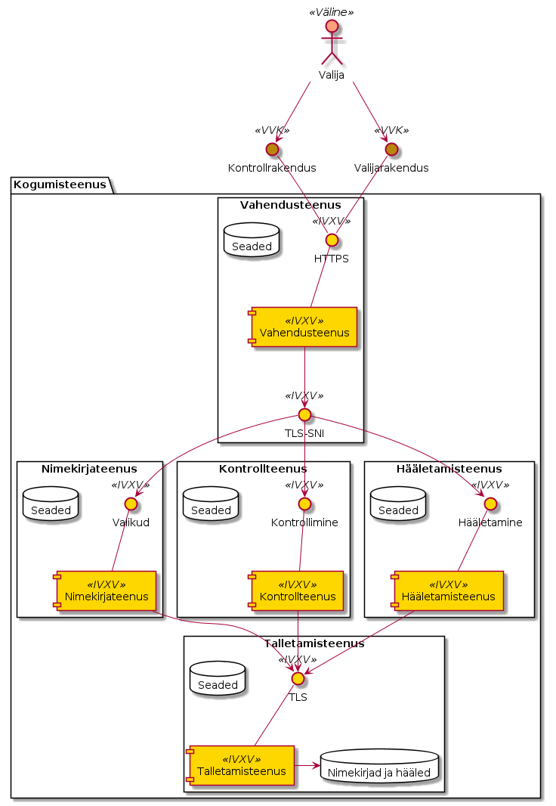
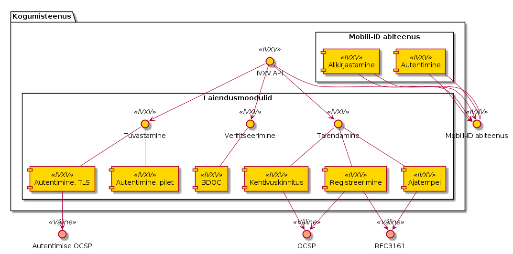
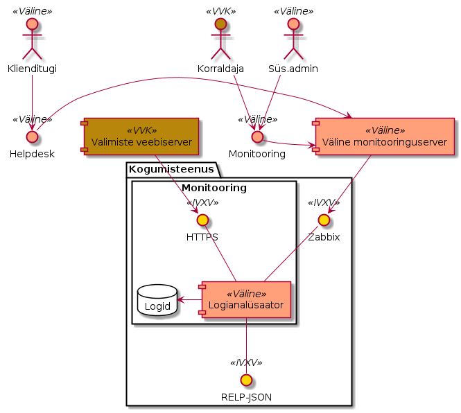
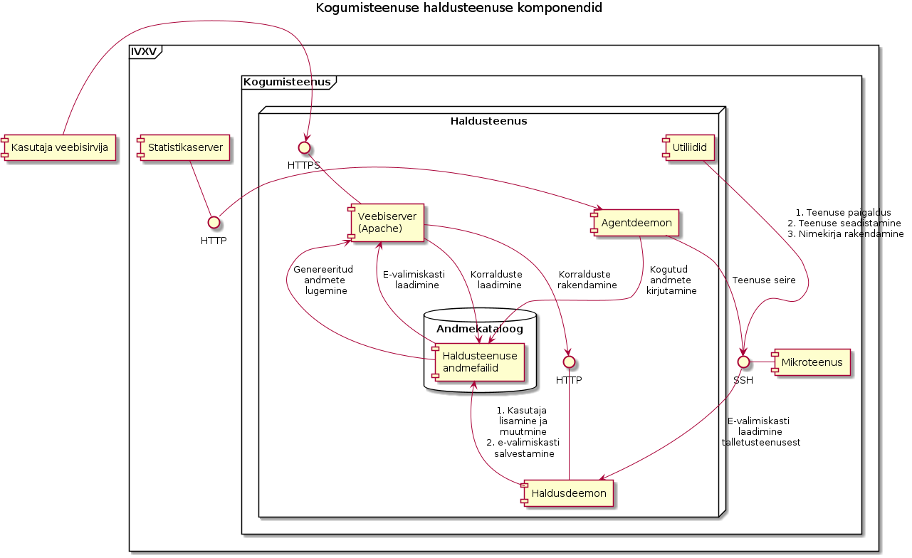
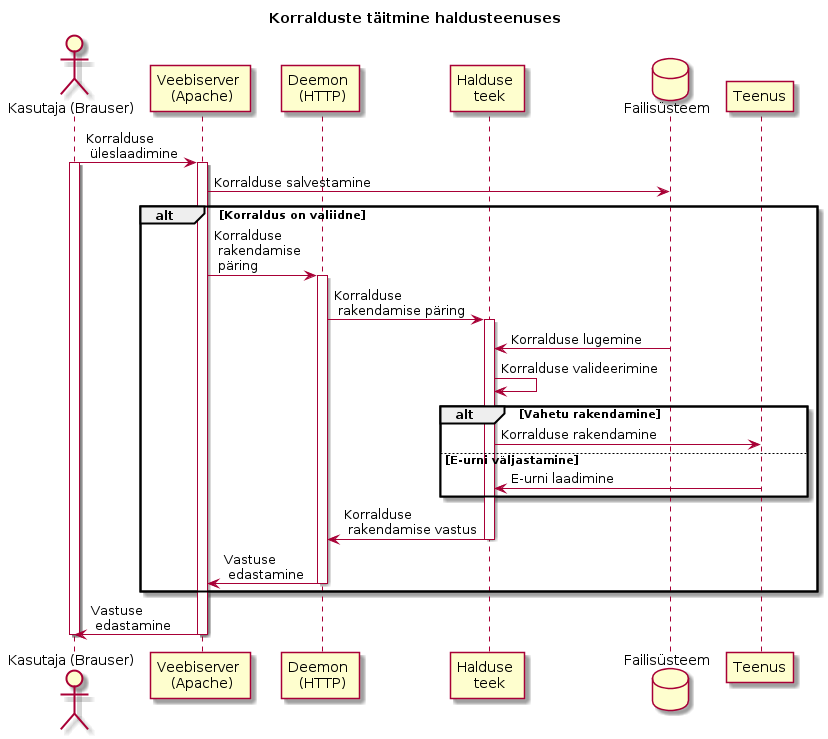
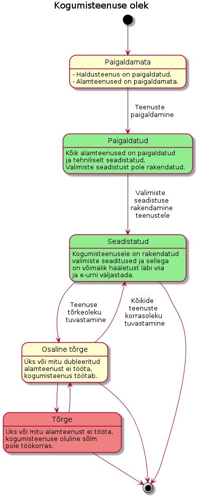
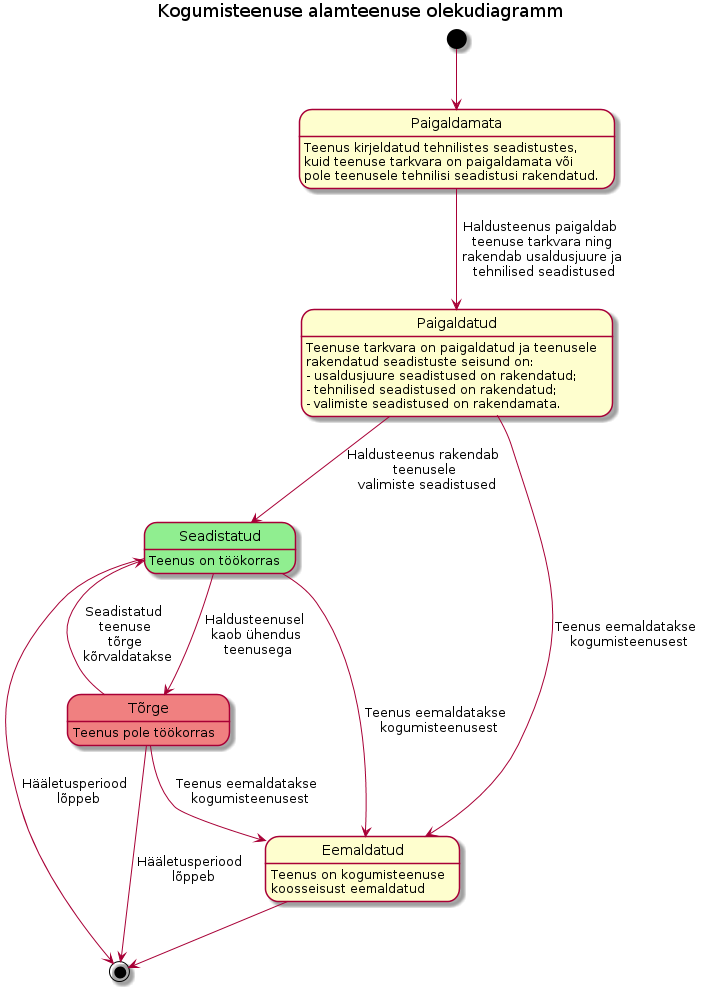

..  IVXV arhitektuur

Kogumisteenus
=============

Üldkirjelduse [ÜK2016]_ põhjal on Kogumisteenus süsteemi keskne komponent, mida käitab Koguja. Teenus abistab Hääletajat e-hääle koostamisel ning registreerib selle enne salvestamist e-urni. Kogumisteenus kasutab väliseid teenuseid (tuvastamine, allkirjastamine, registreerimine). Kogumisteenusel on peale Koguja enda teisigi haldureid (Korraldaja, Klienditugi), kelle jaoks on Kogumisteenusel eraldi haldusliidesed.

Kogumisteenus töötab sidusrežiimis ning vähemalt valija- ja kontrollrakenduse suunalised liidesed on avatud internetile. Seega töötleb Kogumisteenus potentsiaalselt ebausaldusväärsest allikast pärit päringuid. Tulenevalt tarkvarale seatavast turvatasemest, kõrgkäideldavuse, skaleeritavuse, kihilise evitatavuse ning laiendatavuse nõuetest on kogumisteenus omakorda liigendatud ühte konkreetset teenust osutavateks mikroteenusteks, mida on võimalik paindlikult evitada.

Kõik kogumisteenuse komponendid programmeeritakse keeles Go (https://golang.org). Keelel Go on

- staatiline tüüpimine, mis võimaldab tüübivigade avastamist enne programmi käivitamist,
- automaatne mäluhaldus, mis välistab rakenduse vigasest mäluhaldusest tulenevad turvaaugud,
- kompilaator avatud lähtekoodiga ning
- ribastamine/rööprapse, mis võimaldab kasutada paralleelsust mitmetuumalistes süsteemides.

Kogumisteenuse andmeedastusvormingutes kasutatakse üldjuhul JSON-it väljaarvatud olukordades, kus välised asjaolud tingivad mõne muu andmevormingu kasutamist – näiteks BDOC vorming baseerub XML-il.

Kogumisteenus toetab Riigikogu valimisi, kohaliku omavalitsuse volikogu valimisi, Euroopa parlamendi valimisi ning rahvahääletusi.

Kogumisteenuse komponendid arvestavad virtualiseerimistehnoloogiate kasutamisega ning kogumisteenust on võimalik evitada nii ühel virtuaalriistvara instantsil, kui ka mikroteenuste kaupa erinevatel instantsidel. Kogumisteenuse komponendid on evitatavad Ubuntu LTS 16.04 operatsioonisüsteemil 64-bitisel arhitektuuril.

Andmesäilitus on realiseeritud kasutades võti-väärtus andmebaasi (etcd).
Testotstarbel on teostatud ka andmesäilitus failisüsteemi ning mällu, kuid
neid ei ole soovituslik kasutada tootekeskkonnas. Lisaks on kogumisteenusel
olemas liides uute talletusprotokollide lisamiseks. Lõplik otsus kasutatava
lahenduse kohta tehakse kogumisteenuse administraatorite poolt teenust
seadistades.

Mikroteenused
-------------



   Kogumisteenuse jaotus mikroteenusteks

Kogumisteenus on jaotatud põhiteenusteks ja abiteenusteks. Põhiteenused - vahendusteenus, nimekirjateenus, hääletamisteenus, kontrollteenus ning talletamisteenus - on arhitektuuri tehnilise lihtsuse mõttes piiritletud ühe valimisega, kuid ühel riistvaral, ühe operatsioonisüsteemi kontekstis võivad käia mitme valimise mikroteenused. Täiendavalt võib kogumisteenuse juures kasutada abiteenuseid - tuvastusteenust hääletaja isiku tuvastamiseks ning allkirjateenust valijarakenduse poolt hääle allkirjastamise hõlbustamiseks.

Teenuseid on võimalik evitada nii eraldatult kui koos erinevates konfiguratsioonides, mis teeb võimalikuks kihilise arhitektuuri. Lähtudes funktsioonist on otstarbekas hoida Vahendus- ning Talletamisteenused teistest eraldi.

Teenused kasutavad transpordiprotokollina TLS-i, kõik ühendused on mõlemapoolselt autenditud. Rakenduskihi protokoll on JSON-RPC.

Kõik teenused tekitavad tegevuslogi, mida säilitatakse nii lokaalselt kui logitakse rsyslog liidese vahendusel.

Vahendusteenuse funktsioon ja tehniline liides
``````````````````````````````````````````````
Vahendusteenuse põhifunktsiooniks on ühe sisenemispunkti (port 443) pakkumine
Valijarakendusele ja Kontrollrakendusele. Vahendusteenus on dispetšerteenus
teiste komponentide vahel, mis võimaldab sisemiselt evitada kogumisteenust
mikroteenustena, ent omada süsteemi ainult ühte sisenemispunkti. Lisaks suudab
see dubleeritud evituse puhul täita koormusjaoturi ülesannet.

Vahendusteenus ei termineeri TLS-ühendust vaid kasutab TLS-i *Server Name
Indication* (SNI) laiendust sihtpunkti tuvastamiseks. Kliendid panevad TLS
``ClientHello`` sõnumisse SNI laiendi, kus avatekstis määravad, millise
teenusega soovivad suhelda: vahendusteenus näeb seda, võtab ühendust vastavat
teenust pakkuva isendiga ja hakkab kliendi ning teenuse vahelisi sõnumeid
vahendama. Vahendusteenus EI termineeri TLS-i ning ei näe sõnumite sisu.
Vahendusteenusel on andmed kõigi teiste teenuste asukohtadest (aadress:port)
ning teenus vahendab sõnumivahetust kõigi osapoolte vahel.

Vahendusteenus on olekuvaba komponent, mida on võimalik horisontaalselt skaleerida.

Vahendusteenuse teostus
'''''''''''''''''''''''

Vahendusteenuse teostus kasutab vabavaralist HAProxy serverit, mis on
üldlevinud tarkvaraline koormusjaotur ja proksi. Kuna Vahendusteenus on
esimene puutepunkt avalikust internetist tulevate ühenduste jaoks, siis on
mõistlik kasutada tarkvara, mille töökindlus on juba tõestatud.

Kuigi HAProxyt kasutatakse tihti HTTP-režiimis, kus see analüüsib liiklust,
siis vahendusteenuse rollis on see TCP-režiimis ning ei näe vahendatava
krüpteeritud TLS-kanali sisse.

IVXV seadistusest genereeritakse HAProxy seadistusfail, mis sisaldab teiste
teenuste asukohti, ning ühenduste vahendamise ülesanne jääb viimase kanda.
Lisaks on võimalik HAProxyt ka seadistada ühenduste sagedusi piirama
lähteaadressi või mõne muu nimetaja põhjal. See aga jääb süsteemihalduri
ülesandeks.

Kuigi HAProxy on võimeline ise teostama koormusjaoturi ülesannet, on seda
võimalik evitada ka teiste, potentsiaalselt riistvaraliste koormusjaoturite
taha, kus see jääb täitma ainult SNI põhjal vahendmise ülesannet.

HAProxy lähtekood on avalik GPL v2 all ning versioon 1.6.3 on pakendatud
Ubuntu 16.04 ametlikus hoidlas.


Nimekirjateenuse funktsioon ja tehniline liides
```````````````````````````````````````````````
Nimekirjateenuse põhifunktsiooniks on valikute nimekirjade vahendamine Valijarakendusele. Nimekirjateenusesse jõuab informatsioon tuvastatud valija kohta ning Nimekirjateenus väljastab valija ringkonnale vastava valikute nimekirja Talletamisteenusest Valijarakendusse.

Nimekirjateenus on olekuvaba komponent, mida on võimalik horisontaalselt skaleerida.

Kontrollteenuse funktsioon ja tehniline liides
``````````````````````````````````````````````
Kontrollteenuse põhifunktsiooniks on kontrollpäringute töötlemine ning kontrollitava hääle väljastamine Talletamisteenusest Kontrollrakendusse.

Kontrollteenus on olekuvaba komponent, mida on võimalik horisontaalselt skaleerida.

Hääletamisteenuse funktsioon ja tehniline liides
````````````````````````````````````````````````
Hääletamisteenuse põhifunktsiooniks on hääletamispäringute töötlemine. Hääletamisteenus verifitseerib sissetuleva hääle, registreerib selle Registreerimisteenuses ning talletab Talletamisteenusesse.

Hääletamisteenus on olekuvaba komponent, mida on võimalik horisontaalselt skaleerida.

Talletamisteenuse funktsioon ja tehniline liides
`````````````````````````````````````````````````
Talletamisteenuse põhifunktsiooniks on valikute ja valijanimekirjade ning häälte pikaajaline talletamine.

Talletamisteenuse horisontaalseks skaleerimiseks tuleb kasutada hajustalletamist võimaldavat säilitustehnoloogiat.

Talletamisteenuse teostus
'''''''''''''''''''''''''

Talletamisteenus ei ole teadlik IVXV protokollist ega talletatavate andmete
spetsiifikast, vaid on üldkasutatav võti-väärtus andmebaas binaarandmete
säilitamiseks. Kogu teadmus talletatavate andmete struktuurist ja võtmete
hierarhiast on teistes, Talletamisteenust kasutatavates teenustes, mis
käituvad nii-öelda "tarkade" klientidena.

Selline lähenemine lubab kasutada ükskõik millist üldlevinud võti-väärtus
andmebaasi Talletamisteenusena ilma suurema vaevata: ainsateks ülesanneteks on
IVXV seadistuse teisendamine andmebaasi jaoks sobilikku vormingusse ning
teenuse käivitamine. Andmebaasi tarkvara peab võimaldama vaid võtme järgi
talletamist ja lugemist, võtmete prefiksi järgi loetlemist ning atomaarset
võrdle-ja-vaheta (*compare-and-swap*) operatsiooni.

Talletamisteenus on kogumisteenuse töökiiruse oluliseks määrajaks: seetõttu
mõjutab seda teenust pakkuv riistvara kogu süsteemi jõudlust ning see tuleks
vastavalt kasutatavale andmebaasile dimensioneerida.

Hetkel ainus tooteks mõeldud Talletamisteenuse teostus kasutab hajusat
võti-väärtus andmebaasi etcd. Selle puhul tuleks järgida etcd autorite
riistvara soovitusi aadressil
https://coreos.com/etcd/docs/latest/op-guide/hardware.html.

Tuvastusteenuse funktsioon ja tehniline liides
``````````````````````````````````````````````
Tuvastusteenuse põhifunktsiooniks on valija identiteedi tuvastamine. Tuvastusteenus on vajalik näiteks Mobiil-ID autentimise korral.

Allkirjateenuse funktsioon ja tehniline liides
``````````````````````````````````````````````
Allkirjateenuse funktsiooniks on Valijarakenduse toetamine hääle allkirjastamisel. Allkirjateenus on vajalik näiteks Mobiil-ID allkirjastamise korral.

Mobiil-ID abiteenuse teostus
''''''''''''''''''''''''''''

IVXV koosseisu kuulub Mobiil-ID abiteenus, mis käitub Mobiil-ID jaoks nii
Tuvastusteenusena kui ka Allkirjateenusena. Valijarakendus esitab IVXV
päringud Mobiil-ID abiteenusele, mis teisendab need Mobiil-ID päringuteks ning
edastab Mobiil-ID teenusepakkujale.

Eduka Mobiil-ID isikutuvastuse korral väljastab abiteenus Valijarakendusele
pileti, mille abil on võimalik teistele teenustele valija identiteeti
kinnitada. Iga piletiga saab hääletada ainult ühe korra.

Allkirjastamise korral saadab Valijarakendus Mobiil-ID abiteenusele vaid
allkirjastatava hääle räsi ning kasutab vastuseks saadud signatuuri samamoodi
kui ID-kaardiga loodud signatuuri.

Mobiil-ID abiteenus sisaldab küll olekut pooleliolevate tuvastusseansside
kohta, aga muus osas on tegu olekuvaba komponendiga. Tänu sellele on võimalik
Mobiil-ID abiteenust horisontaalselt skaleerida, eeldusel et ühe
tuvastusseansi kõik päringud edastatakse samale isendile.

Kogumisteenuse mikroteenuste evitamine
``````````````````````````````````````
Kogumisteenuse mikroteenused sõltuvad välistest pakkidest minimaalselt. Soovitatav on rsyslog teenuse kasutamine.

Kogumisteenuse mikroteenused pakendatakse deb vormingus, neid on võimalik evitada ka docker'i-laadsete konteineritena.

Välised teenused ja laiendatavus
--------------------------------



   Kogumisteenuse laiendusmoodulid ja välised teenused

Kogumisteenuse mikroteenused kasutavad laiendusmooduleid teostamaks erinevaid
mehhanisme valija tuvastamiseks, digiallkirjade verifitseerimiseks ja
täiendamiseks, sealhulgas hääle registreerimiseks. Laiendusmoodulid võivad
teostuse võimaldamiseks kasutada väliseid teenuseid. Mikroteenuste
laiendatavuse huvides on defineeritud Go API, mille alusel saab realiseerida
ka täiendavaid mooduleid. Hetkel on realiseeritud järgmised moodulid:

- Autentimine TLS sertifikaadiga (ID-kaart)
- Autentimine Tuvastusteenuse piletiga (Mobiil-ID)
- BDOC verifitseerimine
- Kehtivuskinnitusteenus OCSP
- Ajatempliteenus RFC 3161
- Registreerimisteenus OCSP
- Registreerimisteenus RFC 3161

IVXV krüptograafilises protokollis on kesksel kohal Registreerimisteenus, mis osaleb samuti häälte pikaajalisel talletamisel.

Registreerimisteenuse funktsioon
``````````````````````````````````````````````

Registreerimisteenuse põhifunktsioon on võtta Hääletamisteenuselt vastu allkirjastatud registreerimispäringuid, kinnitada neid omapoolse allkirjastatud vastusega ning säilitada vähemalt hääletamisperioodi lõpuni, hilisemaks auditeerimiseks.

Auditeerimisel tekkivate võimalike erisuste lahendamiseks on oluline, et

- Registreerimisteenus on võimeline tõestama, et igale tema poolt väljastatud kinnitusele eelnes Talletamisteenuse poolne registreerimispäring
- Talletamisteenus on võimeline tõestama, et iga tema poolt talletatud hääle kohta on olemas Registreerimisteenuse kinnitus

Piisav protokoll sellise tõendamistaseme saavutamiseks on, kus mõlemal osapoolel on olemas võtmepaar allkirjastamiseks, päringud ja vastused on allkirjastatud ning kumbki pool peab registrit teise poole teadete üle. Selline protokoll on realiseeritav näiteks OCSP-põhise Registreerimisteenuse korral. Samas võib esineda juhtumeid, kus näiteks registreerimispäringute allkirjastamine ei ole standardsete vahenditega võimalik - RFC 3161 põhine registreerimine - sellisel juhul tuleb registreerimisteenusele vajalik tõendusmaterjal anda muude organisatsioonilis-tehniliste vahenditega.

Registreerimisteenusel on täna kaks erinevat teostust:

- OCSP liides eeldab Eestis rakendatava OCSP-põhise ajamärgendamisteenuse kasutamist, kus allkirjastatud OCSP-päringu nonsiks on Hääletamisteenuse poolt pandud hääle räsi. Päring on allkirjastatud standardsete OCSP vahenditega.
- RFC 3161 liides, mille korral ebastandardse lahendusena pannakse ajatemplipäringu nonsiks Hääletamisteenuse poolt allkirjastatud hääle räsi.


Kogumisteenuse laiendusmoodulite lisamine
``````````````````````````````````````````````

Kogumisteenuse API defineerib kuute tüüpi laiendusmooduleid:

- isikutuvastus (Go pakk ``ivxv.ee/auth``, näiteks ``tls``),
- tuvastatud isiku sertifikaadist valija identifikaatori tuletamine (Go pakk
  ``ivxv.ee/identity``, näiteks ``serialnumber``),
- valija identifikaatorist vanuse tuletamine (Go pakk ``ivxv.ee/age``, näiteks ``estpic``),
- allkirjastatud konteineri verifitseerimine (Go pakk ``ivxv.ee/container``, näiteks ``bdoc``),
- allkirja kvalifitseerimine (Go pakk ``ivxv.ee/q11n``, näiteks ``tspreg``) ja
- andmetalletusprotokoll (Go pakk ``ivxv.ee/storage``, näiteks ``etcd``).

Uue mooduli lisamiseks tuleb moodulpakki lisada uue mooduli identifikaator ning
mooduli teostusega alampakk. Alampaki alglaadimisel tuleb kutsuda välja
moodulpaki ``Register`` funktsioon mooduli registreerimiseks.

Uue mooduli kasutamiseks tuleb selle identifikaator lisada seadistusse vastava
moodulitüübi seadistuse juurde koos alammooduli seadistusega. Laiendusmoodulile
antakse ette tema identifikaatoriga viidatud seadistusblokk, mida see
mooduli-siseselt edasi töötleb.

Moodulpakid ja nende moodulitelt nõutavad liidesed on täpsemalt kirjeldatud
dokumendis ``IVXV API``. Samuti on iga mooduli kohta olemas vähemalt üks teostus, mida saab kasutada eeskujuna.


Monitooring
-----------



   Monitooringulahendus

Logimine
````````

Iga mikroteenuse poolt genereeritav logi defineeritakse süstemaatiliselt,
lähtudes protokollikirjeldusest ning teenuse osutamise olekudiagrammist.
Logitakse minimaalselt:

* iga päringu kättesaamise fakt ning töötlemise algus;

* töötlemise üleandmine välisele komponendile;

* töötlemisjärje naasmine komponenti;

* päringu töötlemise lõpp ning tulemus;

* täiendavalt oluliste etappide läbimine protsessi olekumudelis.

Logimisel järgitakse järgmisi põhimõtteid:

* Logimiseks kasutatakse rsyslog teenust, mis registreerib logiteate
  kirjutamise hetke millisekundi täpsusega;

* Iga seansi alustamisel genereerib süsteem unikaalse identifikaatori, mida
  klientrakendus kasutab oma päringutel kesksüsteemi poole pöördumiseks;

* Kõik ühe seansi alla kuuluvad logikirjed sisaldavad sama
  seansiidentifikaatorit;

* Logikirje on unikaalselt identifitseeritav;

* Iga logitava teate juures on võimalik unikaalse tunnuse abil üksüheselt
  tuvastada teate tekkimise koht monitooritavas süsteemis;

* Logikirje on JSON vormingus, automaatse monitooringu jaoks on masinloetavus
  primaarne ning inimloetavus sekundaarne;

* Logisse minev info saneeritakse (urlencode), peale pannakse pikkuse piirang
  (kogu piirang ja parameetri kaupa);

* Süsteemiperimeetrist väljastpoolt pärinevat infot logitakse ainult
  saneerituna, ainult etteantud pikkuses.

Kuna logimine toimub rsyslog vahendusel, on võimalik Guardtime mooduli
kasutamine logide tervikluse tagamiseks.


Üldstatistika
`````````````

Järgmise statistika jälgimiseks kasutatakse staatilist veebiliidest

* edukalt kogutud hääled/hääletajate hulk;

* hääletajate jagunemine sugude, eagruppide, operatsioonisüsteemide ning
  autentimisvahendite kaupa;

* edukalt kontrollitud häälte/hääletajate hulk;

* korduvhääletamiste statistika;

* hääletajate jagunemine riigiti IP-aadressi põhjal.


Detailstatistika
````````````````

Detailstatistika agregeeritakse logide põhjal kasutades SCCEIV
logianalüsaatorit, mis  analüüsib rakenduste tegevuslogi eeldefineeritud
profiili suhtes ning võimaldab seansi-/veatüübipõhist analüüsi.

Detailstatistika on kättesaadav üle HTTPS liidese.


.. _kogumisteenuse-haldus:

Haldus
------

Kogumisteenuse administreerimine toimub digitaalallkirjastatud seadistuspakkide
abil.

Kogumisteenus pakub seadistuspakkide laadimiseks kahte liidest:

* Käsurealiides – rakendus verifitseerib allkirja, valideerib korralduste
  kooskõlalisust ja sobivust kogumisteenuse seisundi suhtes. Korralduse
  rakendamine toimub eraldi utiliidi abil.

* Veebiliides – veebiliides vahendab seadistuspaki käsurealiidesele ja tagastab
  kasutajale info laadimise tulemuse kohta. Eduka laadimise korral toimub
  automaatselt ja samadel põhimõtetel ka seadistuspaki rakendamine.

Veebiliidese funktsioonideks on:

* Kogumisteenuse mikroteenuste seisundi jälgimine;

* Valimiste nimekirjade haldus;

* Statistika kuvamine e-hääletamise kulgemise kohta;

* Haldusteenuse kasutajate haldus;

* Kogumisteenuse halduse logi kuvamine.

Kõik rakendusele antud korraldused säilitatakse - ka need mida ei rakendatud,

Kogumisteenus võib järgmisi tegevusi teostada automaatselt:

* Talletatud häälte, logide ning seadistuste varundamiseks ettevalmistamine –
  konteinerisse pakendamine.


Haldusteenuse komponendid
`````````````````````````



   Kogumisteenuse haldusteenuse komponendid

#. **Halduse veebiserver** on süsteemse kasutaja ``www-data``
   õigustes töötav Apache server, mille ülesanded on:

   #. Kasutajatelt tulevate HTTPS-päringute esmane teenindamine:

      #. Haldusteenuse usaldusväärsuse tõestamine (TLS-sertifikaat);

      #. Kasutajate autentimine;

   #. Valmisgenereeritud veebilehtede ja andmefailide serveerimine
      andmehoidlast.

   #. Üldiste taustaandmete päringu vastuse varustamine sisseloginud kasutaja
      andmetega (WSGI).

   #. Üleslaaditavate korralduste esmane valideerimine ja vahendamine
      haldusdeemonile ning haldusdeemoni sellekohaste vastuste vahendamine
      kliendile (WSGI).

#. **Haldusdeemon** on kasutajakonto ``ivxv-admin`` õigustes töötav ja
   kohalikul (``localhost``) liidesel kuulav veebiserver mille ülesanded on:

   #. Üleslaaditavate korralduste valideerimine;

   #. Üleslaaditavate korralduste vahetu rakendamine (kasutajate haldus);

   #. Üleslaaditavate korralduste salvestamine hilisemaks rakendamiseks
      (seadistuse ja valimisnimekirjade rakendamiseks teenusele);

   #. E-urni allalaadimise vahendamine.

#. **Agentdeemon** on kasutajakonto ``ivxv-admin``
   õigustes töötav deemon, mille ülesanded on:

   #. Andmete kogumine ja registreerimine:

      #. Teadaolevate mikroteenuste seisund;

      #. Tegevusmonitooringu statistika allalaadimine;

#. **Andmehoidla** on failisüsteemis asuv kataloog, kuhu haldusteenuse
   komponendid hoiavad kogutud ja genereeritud andmeid (vaata üksikasjalist
   kirjeldust ``IVXV kogumisteenuse haldusjuhendi`` lisadest);

Välised komponendid, millega haldusteenus kokku puutub:

#. **Kogumisteenuse alamteenused** - paigaldamine, seadistamine ja seisundi
   andmete kogumine toimub agentdeemoni kaudu (SSH-ühendus teenuse masinasse);

#. **Seireserver** - üldstatistika andmete allalaadimine haldusteenuses
   kuvamiseks;

.. note::

   Veebiserver (WSGI), Haldusdeemon ja Agentdeemon on teostatus Python-keeles
   ja kasutavad ühist **halduse teeki**



   Korralduste laadimine haldusteenusesse


Kogumisteenuse seisundid
------------------------

Kogumisteenuse seisund kajastab teenuse kõigi alamteenuste seisundit,
kasutuselolevate väliste teenuste seisundit ja eelneva põhal tuletatud
üldseisundit. Kogumisteenuse üldseisundi tuvastamisega tegeleb haldusteenus.

Üldseisundi olekud on:

#. **Paigaldamata** - seisund pärast haldusteenuse paigaldamist kuni kõigi
   alamteenuste paigaldamiseni;

#. **Paigaldatud** - kõik alamteenused on paigaldatud neile on rakendatud
   tehnilised seadistused ja teenuse toimimiseks vajalikud krüptovõtmed.
   Valimiste seadistust pole rakendatud (kuid võib olla laaditud
   haldusteenusesse);

#. **Seadistatud** - kogumisteenus on seadistatud ja töökorras, sellega on
   võimalik hääletust läbi viia ja e-urni väljastada.

#. **Osaline tõrge** - kogumisteenus on seadistatud ja osaliselt töökorras,
   mõned alamteenused pole töökorras, kuid see ei takista kogumisteenuse
   toimimist.

#. **Tõrge** - kogumisteenuse oluline sõlm pole töökorras, teenuse nõuetekohane
   osutamine pole võimalik.



   Kogumisteenuse olekudiagramm. Olekud vastavalt värvusele: kollane -
   seadistamisel, punane - viga, roheline - töökorras.


Kogumisteenuse alamteenuste seisundid
`````````````````````````````````````



   Haldusteenuse poolt registreeritud alamteenuse olekudiagramm. Olekud
   vastavalt värvusele: kollane - seadistamisel, punane - viga, roheline -
   töökorras.


Kogumisteenuse seisundi muutused
````````````````````````````````

Kogumisteenuse seisund on jälgimav alates haldusteenuse edukast
paigaldamisest, algne seisund on **Paigaldamata**.


Paigaldamata
''''''''''''

Toimub usaldusjuure ja tehnilise seadistuse rakendamine kogumisteenusele:

#. Seadistuste laadimine kogumisteenusesse;

#. Tehnilises seadistuses kirjeldatud alamteenuste paigaldus;

#. Usaldusjuure ja tehniliste seadistuste rakendamine alamteenustele;

Seadistuste eduka rakendamise tulemusena saab süsteemi uueks seisundiks
**Paigaldatud**.


Paigaldatud
'''''''''''

Kogumisteenuse seadistused on rakendatud kõigile alamteenustele, valimiste
seadistused pole rakendatud. Toimub valimiste seadistuse laadimine
haldusteenusesse ja rakendamine alamteenustele.

Valimiste seadistuse eduka rakendamise korral saab süsteemi uueks seisundiks
**Seadistatud**.


Seadistatud
'''''''''''

Kõik kogumisteenuse alamteenused on seadistatud ja töökorras. Haldusteenusel on
kõikidest alamteenustest värsked seisundiraportid. Süsteemiga on võimalik
hääletust läbi viia ja e-urni väljastada.

Kui süsteemis tuvastatakse tõrge, saab süsteemi uueks **Osaline tõrge**.

**Seadistatud** olekust ei pöörduta enam kunagi tagasi olekutesse
**paigaldamata** või **paigaldatud**, kuigi uute alamteenuste lisamisel (kuni
need on olekus **paigaldamata/paigaldatud**) oleks vastavad tingimused
täidetud.


Osaline tõrge
'''''''''''''

Süsteem on seadistatud ja osaliselt töökorras, mõned süsteemi dubleeritud osad
pole töökorras, kuid see ei takista süsteemil toimimast.

Rikke süvenemisel piirini, kus süsteem pole võimeline teenust osutama, saab
süsteemi uueks olekuks **Tõrge**. Kõigi rikete kõrvaldamise järel saab
süsteemi uueks olekuks **Seadistatud**.


Tõrge
'''''

Seadistatud süsteemil on tuvastatud rike, mis takistab teenuse osutamist.

Rikete kõrvaldamisel olukorrani, kus süsteemiga on võimalik teenust osutada,
saab süsteemi uueks olekuks **Osaline tõrge**.

.. vim: sts=3 sw=3 et:
