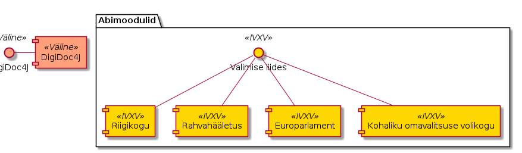
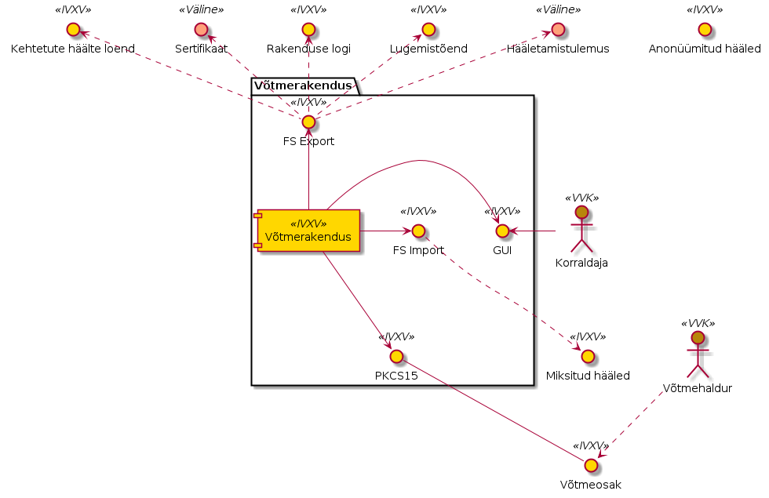
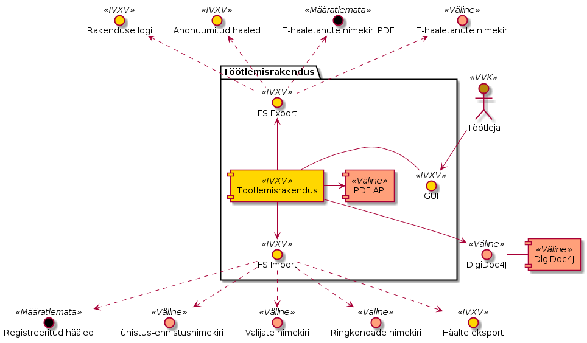
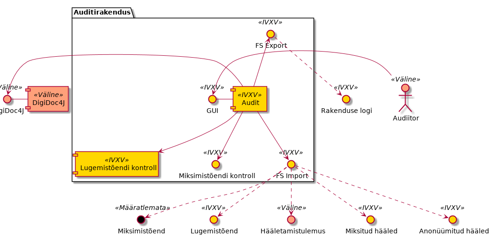

..  IVXV arhitektuur

Rakendused
==========


Üldpõhimõtted
-------------

Kõik rakendused on käsurealiidesega rakendused, mis on pakendatud töötama operatsioonisüsteemi Windows 7 (või uuem) keskkonnas. Komponentide kasutajaliidesed on ühekeelsed. Komponendid tarnitakse eestikeelsetena, nende tõlkimine on võimalik tõlkefaili abil.

Rakendused programmeeritakse keeles Java.

Väliste infosüsteemidega suhtlevad rakendused kasutavad maksimaalselt olemasolevaid liideseid/andmestruktuure.

Rakendused saavad oma sisendi rakenduste seadistustest ja seadistustes näidatud failidest failisüsteemis ning salvestavad oma väljundi kasutaja näidatud kausta failisüsteemis. Failid võivad paikneda ka operatiiv-mälukettal.

Relevantsed rakendused toetavad ElGamal krüptosüsteemi täisarvujäägikorpustel ning P-384 elliptkõveral. Lugemistõend realiseeritakse Schnorri nullteadmustõestusel põhineval protokollil.



   Rakenduste abimoodulid


Rakenduste jaoks unifitseeritakse valimise liides, mis võimaldab erinevate valimistüüpide realiseerimist moodulitena. Digiallkirja verifitseerimise funktsionaalsus luuakse digidoc4j teegi (https://github.com/open-eid/digidoc4j) abil. Abimoodulite kasutamist alljärgnevatel skeemidel eraldi välja ei tooda.

Rakenduste seadistamine
```````````````````````

Rakendused seadistatakse kas digitaalallkirjastatud konfiguratsioonipakiga või käsureavõtmetega. Hierarhilise struktuuriga seadistuste sisestamist käsureavõtmed ei toeta. Seadistused konfiguratsioonipakis kirjeldatakse keeles YAML:

.. code-block:: yaml

   check:
     ballotbox: votes.zip
     ballotbox_checksum: votes.zip.sha256sum.bdoc
     districts: TESTKOV2017.districts.json
     registrationlist: register.zip
     registrationlist_checksum: register.zip.sha256sum.bdoc
     tskey: ts.pub.key
     vlkey: test.gen.pub.key
     voterlists:
       -
         path: 00.TESTKOV2017.gen.voters
         signature: 00.TESTKOV2017.gen.voters.signature
       -
         path: 03.TESTKOV2017.gen.voters
         signature: 03.TESTKOV2017.gen.voters.signature
       -
         path: 06.TESTKOV2017.gen.voters
         signature: 06.TESTKOV2017.gen.voters.signature
       -
         path: 09.TESTKOV2017.gen.voters
         signature: 09.TESTKOV2017.gen.voters.signature
     election_start: 2017-05-01T12:00:00+03:00
     out: out-1
   squash:
     ballotbox: out-1/bb-1.json
     ballotbox_checksum: out-1/bb-1.json.sha256sum.bdoc
     districts: TESTKOV2017.districts.json
     out: out-2
   revoke:
     ballotbox: out-2/bb-2.json
     ballotbox_checksum: out-2/bb-2.json.sha256sum.bdoc
     districts: TESTKOV2017.districts.json
     revocationlists:
       - 12.TESTKOV2017.gen.revoke.json
       - 13.TESTKOV2017.gen.revoke.json
       - 14.TESTKOV2017.gen.revoke.json
       - 15.TESTKOV2017.gen.revoke.json
     out: out-3


Sisendite kooskõlalisuse kontroll
`````````````````````````````````

Kõik rakendused teostavad konfiguratsioonile sisendite kooskõlalisuse kontrolli vastavalt nende poolt kasutatavale konfiguratsioonile:

#. sertifikaatide konfiguratsiooni laadimine;
#. konfiguratsiooni digiallkirja verifitseerimine;
#. ringkondade nimekirja verifitseerimine;
#. ringkondade nimekirja kooskõlalisuse kontroll;
#. ringkondade nimekirja laadimine;
#. valikute nimekirja verifitseerimine;
#. valikute nimekirja kooskõlalisuse kontroll;
#. valikute nimekirja laadimine;
#. valijate nimekirjade verifitseerimine;
#. valijate nimekirjade kooskõlalisus kontroll;
#. valijate nimekirjade laadimine;

Võtmerakendus
-------------



   Võtmerakenduse liidesed


Võtmerakendus on rakendus, millega genereeritakse iga hääletamise jaoks häälte salastamise ja häälte avamise võti ning mille abil toimub häälte lugemine ja tulemuse väljastamine.

Võtmerakendus kasutab [DesmedtF89]_  läviskeemi, mis baseerub usaldataval osakujagajal ning rakendab Shamiri osakujagamist, mis on informatsiooniteoreetiliselt turvaline t < M osapoole korral, kus M on lävipiir.

Võtmeosakud genereeritakse operatiivmälus ning talletatakse kiipkaardile PKCS15 liidese vahendusel.

Võtmerakenduse sisend võtme genereerimisel on

- Võtmepaari identifikaator
- Krüptosüsteemi ElGamal spetsifikatsioon – täisarvujäägikorpus või P-384 elliptkõver ning võtmepikkus
- M-N läviskeemi spetsifikatsioon, mis peab vastama reeglile N >= 2 * M - 1
- N PKCS15 ühilduvat kiipkaarti

Võtmerakenduse väljund võtme genereerimisel on

- Isesigneeritud sertifikaat
- N võtmeosakut talletatuna kiipkaartidel
- Rakenduse detailne tegevuslogi
- Rakenduse detailne vealogi

Võtmerakenduse sisend häälte lugemisel on

- Miksitud hääled
- Võtmepaari identifikaator
- M võtmeosakut vastavalt läviskeemi spetsifikatsioonile

Võtmerakenduse väljund häälte lugemisel on

- Signeeritud hääletamistulemus
- Kehtetute häälte loend
- Lugemistõend (Schnorri nullteadmustõestusel põhinev protokoll nagu viidatud hankedokumentides)
- Rakenduse detailne tegevuslogi
- Rakenduse detailne vealogi

Lisaks varem defindeeritud liidestele ja sõltuvustele kasutab töötlemisrakendus kolmanda osapoole teeki PKCS15 liidese realiseerimiseks. Konkreetne teek valitakse välja projekteerimisfaasis.

Töötlemisrakendus
-----------------

Töötlemisrakendus on rakendus hääletamisperioodil kogutud häälte verifitseerimiseks, tühistamiseks ning anonüümimiseks, mis toimib vastavalt Üldkirjelduse jaotisele 7.6.

Töötlemisrakenduse sisendid on

- kogumisteenuse poolt talletatud elektroonilised hääled;
- registreerimisteenuse poolt väljastatud ajamärgendid;
- valijate nimekirjad;
- ringkondade nimekiri;
- tühistusnimekirjad;
- ennistusnimekirjad.

Töötlemisrakenduse väljundid on

- rakenduse detailne tegevuslogi;
- rakenduse detailne vealogi;
- e-hääletanute nimekiri PDF vormingus, vastavalt töötlemise etapile;
- e-hääletanute nimekiri masintöödeldaval kujul, vastavalt töötlemise etapile;
- anonüümitud hääled.

Lisaks varem defindeeritud liidestele ja sõltuvustele kasutab töötlemisrakendus kolmanda osapoole teeki PDFide väljastamise funktsionaalsuse realiseerimiseks.



   Töötlemisrakenduse liidesed

Elektrooniliste häälte täielik töötlemine
`````````````````````````````````````````

Elektrooniliste häälte täielik töötlemine on tegevus, mille käigus töötlemisrakendus võrdleb Kogumisteenuse poolt talletatud häältehulka registreerimisteenuse poolt talletatud häältehulgaga, kontrollib talletatud häälte vastavust valimiste konfiguratsioonile, tuvastab loendamisele minevad hääled ning anonüümistab need Võtmerakendusele üle andmiseks.

#. rakenduse seadistuste laadimine
#. elektrooniliste häälte digitaalallkirjade verifitseerimine;
#. registreerimisteenuse kinnituste verifitseerimine;
#. ajamärgendite verifitseerimine;
#. iga valija kohta viimase kehtiva hääle tuvastamine;
#. algse elektrooniliselt hääletanute nimekirja väljastamine PDF-vormingus;
#. tühistus- ja ennistusnimekirjade verifitseerimine;
#. tühistus- ja ennistusnimekirjade kooskõlalisuse kontroll;
#. tühistus- ja ennistusnimekirjade rakendamine;
#. miksimisele minevate häälte nimekirja koostamine, krüptogrammide eraldamine digitaalallkirjadest;
#. lõpliku elektrooniliselt hääletanute nimekirja väljastamine masinloetavas vormingus.

Elektrooniliselt hääletanute nimekirja genereerimine
````````````````````````````````````````````````````
#. rakenduse seadistuste laadimine
#. elektrooniliste häälte digitaalallkirjade verifitseerimine;
#. algse elektrooniliselt hääletanute nimekirja väljastamine PDF-vormingus;

Auditirakendus
--------------



   Auditirakenduse liidesed

Auditirakendus (joonis 9) on rakendus, mis verifitseerib matemaatliselt häälte kokkulugemise korrektsust ning miksimise kasutamisel ka miksimise korrektsust.

Auditirakenduse sisendid on

- anonüümitud hääled,
- miksitud hääled,
- miksimistõend (NB! Nii miksimistõend kui konkreetne miksimismeetod on defineerimata),
- hääletamistulemus.

Auditirakenduse väljund on rakenduse detailne tegevuslogi, mis sisaldab ka hinnangut auditi tervikliku õnnestumise kohta. Vajadusel väljastatakse ka rakenduse detailne vealogi.

.. vim: sts=3 sw=3 et:
