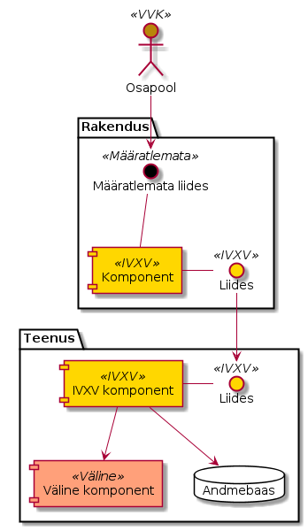

..  IVXV arhitektuur

Sissejuhatus
============

Elektroonilise hääletamise infosüsteem IVXV on loodud lähtuvalt e-hääletamise
raamistikust [ÜK2016]_ ja riigihanke 171780 tehnilisest kirjeldusest [TK2016]_.
Käesolevas dokumendis kirjeldatakse IVXV arhitektuurset lahendust. Elektroonilise
hääletamise infosüsteem koosneb vallasrežiimirakendustest ning
sidusrežiimikomponentidest. Täiendavalt sõltub infosüsteem välistest
infosüsteemidest ning mõjutab vahetult elektrooniliseks hääletamiseks ja hääle
kontrollimiseks kasutatavaid komponente.

Arhitektuuridokument kirjeldab IVXV komponente, nende omavahelisi liideseid ja
liideseid väliste süsteemidega ning komponentide poolt realiseeritavaid protokolle.

IVXV kontseptsioon
------------------

Üldine, kuid terviklik ülevaade elektroonilise hääletamise raamistiku ("IVXV")
tehnilisest ja organisatsioonilisest poolest ning selle rakendamisest Eesti
riiklikel valimistel on antud e-hääletamise raamistiku üldkirjelduses
[ÜK2016]_.

IVXV infosüsteemina teostab "ümbrikuskeemil" põhinevat e-hääletamise
protokolli. IVXV toimib hääletamiseelsel etapil, hääletamisetapil,
töötlusetapil ning lugemisetapil ja pakkub vahendeid elektroonilise hääletamise
protsessis osalemiseks Korraldajale, Lugejale, Hääletajale, Kogujale,
Töötlejale, Miksijale, Audiitorile, Klienditoele, Valijate nimekirja koostajale
ja täiendajale.

Infosüsteemi komponendid on Kogumisteenus, Töötlemisrakendus, Võtmerakendus
ning Auditirakendus. Infosüsteemiga on tihedalt seotud Valijarakendus,
Kontrollrakendus ning Miksimisrakendus.

Infosüsteem kasutab oma töös väliseid teenuseid - Tuvastusteenus,
Allkirjastamisteenus ning Registreerimisteenus.

IVXV krüptograafiline protokoll
-------------------------------

Elektroonilise hääletamise turvalisuse, verifitseeritavuse ning hääletamise
salajasuse, hääletamise korrektsuse ja hääletaja sõltumatuse saavutamiseks on
rangelt kirjeldatud elektroonilise hääletamise krüptograafiline protokoll
[HMVW16]_. Protokoll annab vajaliku ja piisava ülevaate IVXV ülesehitusest ning
selle turvaaspektidest. IVXV komponendid realiseerivad krüptograafilise
protokolli alamosi.

IVXV krüptograafiline protokoll on kirjeldatud ka protokolli turvaomaduste
süsteemiga [ProVerif]_ formaalset verifitseerimist võimaldavas notatsioonis.

Notatsioon
----------

Arhitektuurse lahenduse visandi illustreerimiseks kasutatakse dokumendis
UML-skeeme, kus eristame värvide ja märgenditega ``<<>>`` kodeeritult olemite –
tegijad, liidesed, komponendid – järgmisi aspekte:

* Märgend ``<<IVXV>>`` (Kollane) – infosüsteemi liides või komponent
  defineeritakse/realiseeritakse konkreetse pakkumuse raames tehtavate tööde
  käigus

* Märgend ``<<Väline>>`` (Punane) – infosüsteem sõltub mingi funktsionaalsuse
  realiseerimisel kolmanda osapoole komponendist või olemasolevast liidesest,
  mille ümberdefineerimine eeldab ka kolmandate osapoolte tööd.

* Märgend ``<<VVK>>`` (Pruun) – sarnane eelmisele, kuid liidese/komponendi
  omanikuks on VVK.

* Märgend ``<<Määratlemata>>`` (Must) – infosüsteemi jaoks oluline liides on
  määratlemata.

   Näiteskeem
