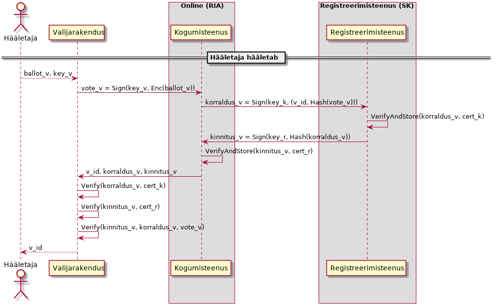
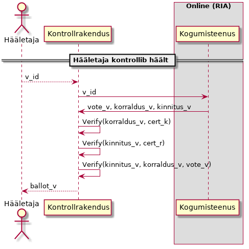
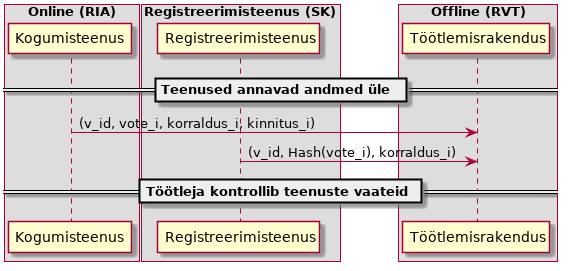

..  IVXV registreerimisteenus

Registreerimisteenus
====================

Registreerimisteenus on teenus, mille abil Kogumisteenus registreerib kõik
Hääletajatelt saadud hääled. Pärast hääletamisperioodi lõppu edastab
Kogumisteenus talletatud hääled Töötlejale ning Registreerimisteenus edastab
registreeritud hääled Töötlejale.

Registreerimisteenus aitab tagada e-urni terviklust. Eeldame et Kogumisteenusel
puudub võimalus võltsida digitaalallkirja ning sellisel moel tekitada juurde
hääli või muuta juba talletatud hääli. Riskina säilib võimalus, et Kogumisteenus
ei anna kõiki talletatud hääli Töötlejale üle. Häälte valikulise üleandmise
riski maandamiseks kasutab IVXV protokoll täiendavat Registreerimisteenust, kuhu
Kogumisteenus iga talletatud hääle registreerib.  Hääletajal on
protokollikohaselt võimalus korrektses registreerimises veenduda --
Registreerimisteenuse digitaalselt allkirjastatud kinnitus konkreetse hääle
registreerimise kohta esitatakse ka konkreetsele hääletajale.

Registreerimisteenus protokollis
--------------------------------

Kogumisteenus saadab Registreerimisteenusele enda poolt allkirjastatud
registreerimiskorralduse (edaspidi KORRALDUS), mis sisaldab hääle
identifikaatorit ja allkirjastatud hääle räsi::

  KORRALDUS = Sign_K(V_id, Hash(VOTE))

Registreerimisteenus veendub, et KORRALDUS on allkirjastatud Kogumisteenuse
poolt, talletab KORRALDUSE hilisemaks väljastamiseks ning vastab
Kogumisteenusele oma poolt allkirjastatud registreerimiskinnitusega (edaspidi
KINNITUS), mis allkirjastab algset KORRALDUST ning KINNITUSE väljastamise aega::

  KINNITUS = Sign_R(Hash(KORRALDUS), t)

Kogumisteenus tagastab nii KINNITUSE kui KORRALDUSE valijarakendusele, Hääletaja
saab teate hääle positiivsest talletamisest ainult KINNITUSE ja selle aluseks
olnud KORRALDUSE edukal verifitseerimisel.

Hääletamisperioodi lõppedes edastab Registreerimisteenus Kogumisteenuse poolt
tehtud KORRALDUSED Töötlejale.

Registreerimisteenus peab Töötlejale algselt andma üle vähemalt loendi::

  (V_id, Hash(VOTE))

Kui Registreerimisteenus annab üle ainult ülalkirjeldatud loendi, siis peab ta
hiljem oleme võimeline andma loendi nõutud elemendile vastava korralduse::

  (V_id, Hash(VOTE)), Sign_K(V_id, Hash(VOTE))




   Registreerimisteenuse roll hääletamisel




   Registreerimisteenuse roll hääle kontrollimisel




   Registreerimisteenuse roll häälte üleandmisel


Registreerimisteenuse liidesed
------------------------------

Registreerimisteenusel on kaks liidest

#. KORRALDUSTE vastuvõtmise ja KINNITUSTE väljastamise liides;

#. KORRALDUSE alusel väljastatud KINNITUSTE loetelu ja nende aluseks olnud
   KORRALDUSTE väljastamise liides.

Registreerimisteenuse funktsionaalsuseks on Kogumisteenusele KINNITUSTE
väljastamine, väljastatud KINNITUSTE ja neile aluseks olevate KORRALDUSTE
säilitamine ja hilisem Töötlejale üleandmine.

Kui Registreerimisteenus osutab teenust mitmele erinevale osapoolele, siis peab
olema garanteeritud, et konkreetse valimisega seotud Kogumisteenuse KORRALDUSED
ja neile vastavad KINNITUSED on Valijarakenduse ja Kontrollrakenduse poolt
kontrollitavalt eristatavad teiste osapoolte KORRALDUSTEST ning neile
vastavatest KINNITUSTEST. Vastasel juhul võib tekkida olukord, kus Kogumisteenus
küll registreerib hääle, kuid info sellest ei jõua Töötlejani.

Registreerimisteenus peab olema võimeline kõiki Kogumisteenuse poolt tulnud
KORRALDUSI üle andma.

Osapoolte nõuded registreerimisteenusele
----------------------------------------

Töötleja
````````

Töötleja ülesanne on muuhulgas tuvastada,

#. millised Kogumisteenuse poolt üle antud hääled lähevad lugemisele ja

#. kas Kogumisteenus on jätnud hääli üle andmata.

Töötleja töö tulemusena selguvaid erisusi tuleb lahendada ning siin on järgmised
3 juhtumit:

#. Kogumisteenus annab Töötlejale üle allkirjastatud hääle koos KINNITUSega,
   Registreerimisteenus annab Töötlejale üle Kogumisteenuse KORRALDUSE, mille
   alusel KINNITUS anti - vaidlust ei ole, kui konkreetne hääl oli antud
   Hääletaja jaoks viimane, siis suunatakse ta lugemisele.

#. Kogumisteenus annab Töötlejale üle allkirjastatud hääle koos KINNITUSega,
   Registreerimisteenus ei anna Töötlejale selle hääle kohta midagi üle. Kuna
   KINNITUS on Registreerimisteenuse poolt allkirjastatud, siis on viga
   Registreerimisteenuse poolel. Kui konkreetne hääl oli antud Hääletaja jaoks
   viimane, siis suunatakse ta lugemisele.

#. Registreerimisteenus annab Töötlejale üle Kogumisteenuse KORRALDUSE,
   Kogumisteenus ei anna Töötlejale vastava räsiga häält üle. Kuna KORRALDUS on
   Kogumisteenuse poolt allkirjastatud, siis on viga Kogumisteenuse poolel ning
   antud hääl tuleb üles otsida.

Hääletaja
`````````

Hääletaja jaoks on oht, et Kogumisteenus võib tema hääle 'unustada'.
Nõuetekohase KINNITUSE nägemine annab Hääletajale kindluse, et väline osapool
garanteerib tema hääle Töötlejani jõudmist. Kindluse jaoks on oluline:

#. KINNITUS on Registreerimisteenuse poolt allkirjastatud;

#. KINNITUSES sisalduv algne KORRALDUS on Kogumisteenuse poolt allkirjastatud;

#. usaldus, et Registreerimisteenus on võimeline KINNITUSE andmise fakti meeles
   pidama;

#. usaldus, et Registreerimisteenus on võimeline KINNITUSE andmise kohasust
   Töötlejale tõestama;

#. usaldus, et Kogumisteenusel ei ole võimalik hankida alternatiivset
   valekinnitust, mis Valijarakenduses verifitseerub, kuid Töötlejani ei jõua.

Kogumisteenus
`````````````

Kogumisteenuse jaoks on oht et, Registreerimisteenuse poolt üleantud KINNITUSTE
ja talletatud häälte vaated erinevad. Kogumisteenuse poolt KORRALDUSELE antud
allkiri on Kogumisteenuse garantii, et Registreerimisteenuse poolt ei saa
tekkida fiktiivseid KINNITUSI, mida Kogumisteenus tegelikult nõudnud pole.

Kogumisteenus talletab kõiki Registreerimisteenuse vastuseid. Kuna need on
allkirjastatud, siis on täiendav info oluline vaid siis kui Kogumisteenus
väidab, et mingit KORRALDUST ei ole antud, kuigi Registreerimisteenus on (v_id,
Hash(VOTE)) esitanud. Sellisel juhul saab Registreerimisteenus esitada terve
Kogumisteenuse KORRALDUSE (või vähemalt selle allkirjastatud komponendi)

Registreerimisteenus
````````````````````

Registreerimisteenus on huvitatud, et vaidlusolukordades, kus Kogumisteenus
jätab midagi üle andmata, oleks tal võimalik oma tegevuse korrektsust tõestada.
Oluline on tagada:

#. Kogumisteenuse poolt konkreetse valimise raames antavad KORRALDUSED on
   teiste klientide poolt esitatud KORRALDUSTEST kontrollitavalt eristatavad.

#. Kogumisteenus ei saa juba esitatud KORRALDUSTE kohta väita, et ta neid ei
   esitanud.

Registreerimisteenuse realiseerimine
------------------------------------

Puristlik vaade on käsitleda Registreerimisteenust seni maailmas
mitteeksisteerinud nähtusena ning realiseerida uus teenus, mis täidab täpselt
neid nõudmiseid ja seda protokolli.

Praktiline probleem on Registreerimisteenuse osutajas, kus Eestis on
ideaalkandidaadiks SK ning uue ja tüütu teenuse osutamine tuleks neile
käepäraseks teha täites samas Registreerimisteenuse algset eesmärki. Seetõttu on
laual kaks võimalikku olemasolevatel protokollidel baseeruvat teenust
Registreerimisteenuse saavutamiseks.

RFC 6960 - OCSP
``````````````````````````````

Registreerimisteenuse idee sai alguse asjaolust, et meil on juba olemas de-facto
registreerimisteenus, kes näeb kõiki hääletamise fakte - OCSP protokollil
baseerub sertifikaatide kehtivuskinnitusteenus. OCSP on lihtne protokoll, kus
päring on allkirjastatud ja vastus on allkirjastatud.

Olemasolevat OCSP teenust on võimalik kasutada registreerimisteenusena
järgmistel tingimustel:

#. teenus toetab allkirjastatud OCSP päringuid

#. teenus on võimeline talletama ja üle andma ajavahemikus konkreetse kliendi
   käest tulnud allkirjastatud päringuid

Eesti ID-kaardi kontekstis tähendab see, et täiendav OCSP kehtivuskinnitus tuleb
võtta ka Mobiil-ID häälte korral, kuna DigiDoc teenuse poolt võetud
kehtivuskinnitus ei täida registreerimistõendi funktsiooni.


Registreerimisteenuse realiseerimine OCSP protokolli vahendusel toimub kasutades
laiendust nonss.

#. Kogumisteenus teeb OCSP teenusele allkirjastatud päringu, kus kasutatakse
   laiendust nonss, mille väärtuseks on allkirjastatud hääle räsi.

#. Vastavalt OCSP protokollile tagastatakse OCSP teenuse allkirjastatud
   vastuses päringus sisaldunud nonss. Teisisõnu saadetakse Kogumisteenusele
   Registreerimisteenuse allkirjaga kinnitus konkreetse räsi eksisteerimise
   kohta.

Hääle räsi kodeerimiseks võib kasutada MessageImprint andmestruktuuri::

  MessageImprint ::= SEQUENCE  {
    hashAlgorithm         AlgorithmIdentifier,
    hashedMessage         OCTET STRING  }


Vastavalt Registreerimisteenuse nõuetele peab OCSP teenusel baseeruv
Registreerimisteenus olema võimeline üle andma loetelu kinnitatud häälte
räsidest ning vaidluste lahendamiseks peab olema võimeline tõestama, et
konkreetne hääle räsi sattus üleantavasse loetelusse põhjusel, et Kogumisteenus
vastavasisulise päringu saatis.

Teisisõnu peab OCSP teenusel baseeruv Registreerimisteenus talletama OCSP
päringute nonsse ning andma üle päringuvastuste aluseks olnud päringuid.

RFC 3161 - PKIX
``````````````````````````````

PKIX on ajatembeldusprotokoll, kus usaldatav kolmas osapool kinnitab oma
allkirjaga andmete eksisteerimist konkreetsel ajahetkel. Protokoll koosneb ühest
päringust ja vastusest.

Ajatemplipäring::

  TimeStampReq ::= SEQUENCE  {
    version               INTEGER  { v1(1) },
    messageImprint        MessageImprint,
      --a hash algorithm OID and the hash value of the data to be
      --time-stamped
    reqPolicy             TSAPolicyId              OPTIONAL,
    nonce                 INTEGER                  OPTIONAL,
    certReq               BOOLEAN                  DEFAULT FALSE,
    extensions            [0] IMPLICIT Extensions  OPTIONAL  }

Ajatembeldatavad andmed esitatakse teenusele messageImprint koosseisus räsina.
TimeStampReq ei sisalda endas päringu esitaja allkirja.

ATO vastus ajatemplipäringule::

  TimeStampResp ::= SEQUENCE  {
    status                PKIStatusInfo,
    timeStampToken        TimeStampToken           OPTIONAL  }

  TimeStampToken ::= ContentInfo
    -- contentType is id-signedData ([CMS])
    -- content is SignedData ([CMS])

  TSTInfo ::= SEQUENCE  {
    version               INTEGER  { v1(1) },
    policy                TSAPolicyId,
    messageImprint        MessageImprint,
      -- MUST have the same value as the similar field in
      -- TimeStampReq
    serialNumber          INTEGER,
      -- Time-Stamping users MUST be ready to accommodate integers
      -- up to 160 bits.
    genTime               GeneralizedTime,
    accuracy              Accuracy                 OPTIONAL,
    ordering              BOOLEAN                  DEFAULT FALSE,
    nonce                 INTEGER                  OPTIONAL,
      -- MUST be present if the similar field was present
      -- in TimeStampReq.  In that case it MUST have the same value.
    tsa                   [0] GeneralName          OPTIONAL,
    extensions            [1] IMPLICIT Extensions  OPTIONAL }


TimeStampResp on ATO poolt digitaalselt allkirjastatud konteiner, mis sisaldab
endas päringu koosseisus saadud messageImprint'i ning nonssi.

Registreerimisteenuse huvides on, et Kogumisteenuse päring oleks signeeritud.
Kuna RFC 3161 ei toeta allkirjastatud päringuid on alternatiiviks kasutada mõnda
laiendust, mis võimaldab Kogumisteenuse signatuuri edastamist. See laiendus
tuleks teenuse poolt ajatempli koosseisus ka tagasi saata.

SK - ATO
````````

SK ATO realiseerib RFC 3161 protokolli. SK ATO on usaldusteenuse osutaja eIDAS'e
mõttes. SK ATO on läbinud vastavusauditi, mis ühest küljest tõstab teenuse
usaldusväärsust, teisest küljest teeb keeruliseks teenuse ümberseadistamise.

SK ATO teenindab kõiki kliente üle avaliku interneti kättesaadava liidese abil,
kõik vastused allkirjastatakse sama võtmega, nende kliendipõhine eristamine ei
ole võimalik, mis teeb SK ATO oma puhtal kujul Registreerimisteenuse osutamiseks
sobimatuks. Põhimõtteliseks takistuseks Registreerimisteenuse turvaeesmärgi
täitmisel on asjaolu, et ajatempli põhjal puudub võimalus tuvastada, kas see on
vastus Kogumisteenuse päringule talletatud hääle kohta või midagi muud asjasse
mitte puutuvat.

Teoreetiliselt saab probleemi lahendada kasutades laiendusi ajatemplipäringus,
mille ATO vastuse koosseisus kliendile tagastab. SK ATO ei toeta laiendusi
kliendi poolt esitatavas ajatemplipäringus ning RFC 3161 ei sõnasta laienduste
tagasipeegeldamise nõuet ühemõtteliselt.

SK ATO talletab pikaajaliselt nii ajatemplipäringuid kui ajatemplivastuseid, mis
loob olulise eelduse selle kasutamiseks Registreerimisteenusena. Ainus võimalus
teha seda teenuse eIDAS vastavuskinnitust ohustamata on kasutada ära
ajatemplipäringu nonssi. See on ASN.1 INTEGER andmetüüp kuhu saab kodeerida
suvalise struktuuriga andmeid, mis teeb võimalikuks järgmise skeemi:

Enne hääletamist:

#. Kogumisteenus genereerib allkirjastamisvõtme ja sertifikaadi.

#. Kogumisteenus annab sertifikaadi Korraldajale üle.

#. Kogumisteenus seadistab ennast SK ATO'd kasutama.

Hääletamise ajal:

#. Valija saadab hääle talletamiseks.

#. Kogumisteenus räsib hääle, allkirjastab räsi ning võtab räsile ajatempli,
   kasutades ajatemplipäringu TimeStampReq nonssina oma allkirja sellel räsil.

#. SK ATO töötleb ajatemplipäringut kooskõlas RFC 3161 nõuetega ning väljastab
   allkirjastatud ajatempli.

#. Kogumisteenus vahendab ajatempli Valijarakendusele, mis teostab järgmised
   kontrollid:

   a) ajatempel on SK ATO poolt allkirjastatud,
   b) ajatempel sisaldab nonssi,
   c) ajatemple sisaldab tema hääle räsi,
   d) nonss on Kogumisteenuse poolt allkirjastatud valija hääle räsi.

Peale hääletamist:

#. Korraldaja annab SK'le ajavahemiku ja Kogumisteenuse sertifikaadi

#. SK otsib kõigi selle ajavahemiku ajatemplipäringute ja vastuste hulgast
   neid, millel

   a) on nonss,
   b) nonss dekodeerub kokkuleppeliseks andmestruktuuriks,
   c) andmestruktuur verifitseerub Kogumisteenuse sertifikaadiga.

#. SK annab üle kõik leitud ajatemplipäringud ja ajatemplid.

#. Kogumisteenus annab üle kõik ajatemplipäringud, ajatemplid ja hääled.

#. Töötleja analüüsib andmeid vastavalt protokollile

NB! Selline otsing ei ole standardses ATO tarkvaras realiseeritud, kuid selle
realiseerimise korral saab SK ATOd Registreerimisteenusena kasutada.

#. KINNITUS on Registreerimisteenuse poolt allkirjastatud;

#. KINNITUSES sisalduv algne KORRALDUS on Kogumisteenuse poolt allkirjastatud;

#. Usaldus, et Registreerimisteenus on võimeline KINNITUSE andmise fakti meeles
   pidama;

#. Usaldus, et Kogumisteenusel ei ole võimalik hankida alternatiivset
   valekinnitust, mis Valijarakenduses verifitseerub, kuid Töötlejani ei jõua

#. Usaldus, et Registreerimisteenus on võimeline KINNITUSE andmise kohasust
   Töötlejale tõestama;

#. Registreerimisteenuse poolt ei saa tekkida fiktiivseid KINNITUSI, mida
   Kogumisteenus tegelikult nõudnud pole

#. Kogumisteenus ei saa juba esitatud KORRALDUSTE kohta väita, et ta neid ei
   esitanud

Nonssi vorming::

  Signature ::= SEQUENCE {
    signingAlgorithm AlgorithmIdentifier,
    signature        ANY DEFINED BY signingAlgorithm
  }

  AlgorithmIdentifier ::= SEQUENCE {
    algorithm  OBJECT IDENTIFIER,
    parameters ANY DEFINED BY algorithm OPTIONAL
  }

Sõnumiks võtame juba olemasoleva TimeStampReq.messageImprint DER-kodeeringu::

  MessageImprint ::= SEQUENCE {
    hashAlgorithm AlgorithmIdentifier,
    hashedMessage OCTET STRING
  }

RSA kasutamisel allkirjastamiseks. Signature.signingAlgorithm.algorithm sõltub
sõnumi hashAlgorithmist::

  pkcs-1 OBJECT IDENTIFIER ::= { iso(1) member-body(2) US(840) rsadsi(113549) pkcs(1) 1 }

  sha-1WithRSAEncryption   OBJECT IDENTIFIER  ::=  { pkcs-1  5 }
  sha224WithRSAEncryption  OBJECT IDENTIFIER  ::=  { pkcs-1 14 }
  sha256WithRSAEncryption  OBJECT IDENTIFIER  ::=  { pkcs-1 11 }
  sha384WithRSAEncryption  OBJECT IDENTIFIER  ::=  { pkcs-1 12 }
  sha512WithRSAEncryption  OBJECT IDENTIFIER  ::=  { pkcs-1 13 }

Signature.signingAlgorithm.parameters puudub või on NULL.

Signature.signature on OCTET STRING, mis sisaldab RSA signatuuri sõnumil.
