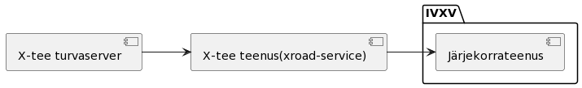

..  IVXV tehniline dokumentatsioon

E-hääletamiste jooksev nimekiri
===============================

Teenus vahendab jooksvat nimekirja EHS-ist X-tee-le.

   X-tee turvaserveri suhtlus EHS-iga

Teenuses konfigureeritakse valimissündmused, mille nimekirja on võimalik küsida.

Teenus pakub kolme otspunkti:

1. ``Valimissündmuste loetelu`` - väljastab aktiivsete valimissündmuste loetelu

2. ``Viimane järjenumber`` - väljastab konkreetse valimissündmuse viimase EHS-s registreeritud e-hääletamise järjenumbri.

3. ``e-hääletamiste pakk`` - väljastab EHS-lt valimissündmuse e-hääletamiste paki, alatest e-hääletamisest järjenumbriga.
